<h3>Linux Distribution</h3>

So, what is a Linux distribution and how does it relate to the Linux kernel?

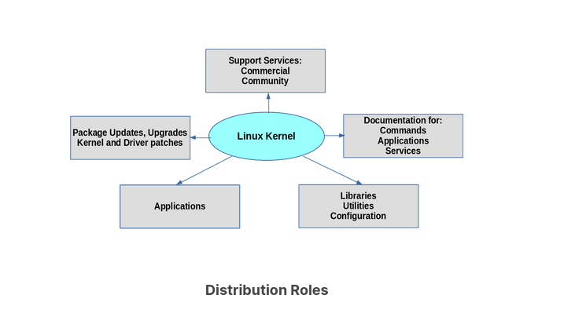

The Linux kernel is the core of the operating system. A full Linux distribution consists of the kernel plus a number of other software tools for file-related operations, user management, and software package management. Each of these tools provides a part of the complete system. Each tool is often its own separate project, with its own developers working to perfect that piece of the system.

While the most recent Linux kernel (and earlier versions) can always be found in The Linux Kernel Archives, Linux distributions may be based on different kernel versions. For example, the very popular RHEL 8 distribution is based on the 4.18 kernel, which is not new, but is extremely stable. Other distributions may move more quickly in adopting the latest kernel releases. It is important to note that the kernel is not an all or nothing proposition, for example, RHEL/CentOS have incorporated many of the more recent kernel improvements into their older versions, as have Ubuntu, openSUSE, SLES, etc.

Examples of other essential tools and ingredients provided by distributions include the C/C++ and Clang compilers, the gdb debugger, the core system libraries applications need to link with in order to run, the low-level interface for drawing graphics on the screen, as well as the higher-level desktop environment, and the system for installing and updating the various components, including the kernel itself. And all distributions come with a rather complete suite of applications already installed.

<h3>Services Associated with Distributions</h3>

The vast variety of Linux distributions are designed to cater to many different audiences and organizations, according to their specific needs and tastes. However, large organizations, such as companies and governmental institutions and other entities, tend to choose the major commercially-supported distributions from Red Hat, SUSE, and Canonical (Ubuntu).

CentOS and CentOS Stream are popular free (as in no cost) alternatives to Red Hat Enterprise Linux (RHEL) and are often used by organizations that are comfortable operating without paid technical support. Ubuntu and Fedora are widely used by developers and are also popular in the educational realm. Scientific Linux is favored by the scientific research community for its compatibility with scientific and mathematical software packages. Both CentOS variants are binary-compatible with RHEL; i.e. in most cases, binary software packages will install properly across the distributions.

Note that CentOS is planned to disappear at the end of 2021 in favor of CentOS Stream. However, there are at least two new RHEL-derived substitutes: Alma Linux and Rocky Linux which are establishing a foothold.

Many commercial distributors, including Red Hat, Ubuntu, SUSE, and Oracle, provide long term fee-based support for their distributions, as well as hardware and software certification. All major distributors provide update services for keeping your system primed with the latest security and bug fixes, and performance enhancements, as well as provide online support resources.

<h3>The Boot Process</h3>

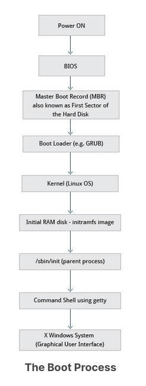

The Linux boot process is the procedure for initializing the system. It consists of everything that happens from when the computer power is first switched on until the user interface is fully operational.

Having a good understanding of the steps in the boot process may help you with troubleshooting problems, as well as with tailoring the computer's performance to your needs.

On the other hand, the boot process can be rather technical, and you can start using Linux without knowing all the details.

<b>NOTE</b>: <i>You may want to come back and study this section later, if you want to first get a good feel for how to use a Linux system.</i>

<h3>BIOS - The First Step</h3>

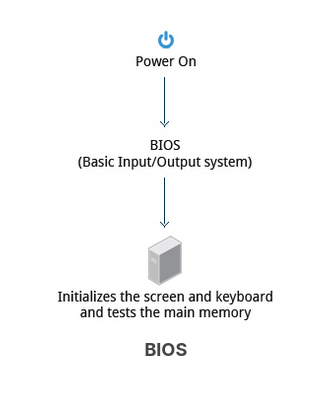

Starting an x86-based Linux system involves a number of steps. When the computer is powered on, the Basic Input/Output System (BIOS) initializes the hardware, including the screen and keyboard, and tests the main memory. This process is also called POST (Power On Self Test).

The BIOS software is stored on a ROM chip on the motherboard. After this, the remainder of the boot process is controlled by the operating system (OS).

<h3>Master Boot Record (MBR) and Boot Loader</h3>

Once the POST is completed, the system control passes from the BIOS to the boot loader. The boot loader is usually stored on one of the hard disks in the system, either in the boot sector (for traditional BIOS/MBR systems) or the EFI partition (for more recent (Unified) Extensible Firmware Interface or EFI/UEFI systems). Up to this stage, the machine does not access any mass storage media. Thereafter, information on date, time, and the most important peripherals are loaded from the CMOS values (after a technology used for the battery-powered memory store which allows the system to keep track of the date and time even when it is powered off).

A number of boot loaders exist for Linux; the most common ones are GRUB (for GRand Unified Boot loader), ISOLINUX (for booting from removable media), and DAS U-Boot (for booting on embedded devices/appliances). Most Linux boot loaders can present a user interface for choosing alternative options for booting Linux, and even other operating systems that might be installed. When booting Linux, the boot loader is responsible for loading the kernel image and the initial RAM disk or filesystem (which contains some critical files and device drivers needed to start the system) into memory.

<h3>Boot Loader in Action</h3>

The boot loader has two distinct stages:

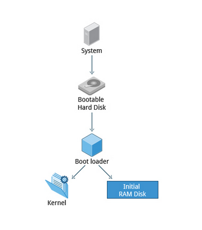

For systems using the BIOS/MBR method, the boot loader resides at the first sector of the hard disk, also known as the Master Boot Record (MBR). The size of the MBR is just 512 bytes. In this stage, the boot loader examines the partition table and finds a bootable partition. Once it finds a bootable partition, it then searches for the second stage boot loader, for example GRUB, and loads it into RAM (Random Access Memory). For systems using the EFI/UEFI method, UEFI firmware reads its Boot Manager data to determine which UEFI application is to be launched and from where (i.e. from which disk and partition the EFI partition can be found). The firmware then launches the UEFI application, for example GRUB, as defined in the boot entry in the firmware's boot manager. This procedure is more complicated, but more versatile than the older MBR methods.

<h3>Initial RAM Disk</h3>

The initramfs filesystem image contains programs and binary files that perform all actions needed to mount the proper root filesystem, like providing kernel functionality for the needed filesystem and device drivers for mass storage controllers with a facility called udev (for user device), which is responsible for figuring out which devices are present, locating the device drivers they need to operate properly, and loading them. After the root filesystem has been found, it is checked for errors and mounted.

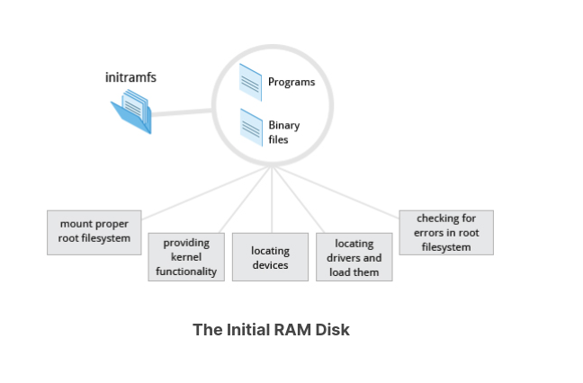

The mount program instructs the operating system that a filesystem is ready for use, and associates it with a particular point in the overall hierarchy of the filesystem (the mount point). If this is successful, the initramfs is cleared from RAM and the init program on the root filesystem (/sbin/init) is executed.

init handles the mounting and pivoting over to the final real root filesystem. If special hardware drivers are needed before the mass storage can be accessed, they must be in the initramfs image.

<h3>Text-Mode Login</h3>

Near the end of the boot process, init starts a number of text-mode login prompts. These enable you to type your username, followed by your password, and to eventually get a command shell. However, if you are running a system with a graphical login interface, you will not see these at first.

As you will learn in Chapter 7: Command Line Operations, the terminals which run the command shells can be accessed using the ALT key plus a function key. Most distributions start six text terminals and one graphics terminal starting with F1 or F2. Within a graphical environment, switching to a text console requires pressing CTRL-ALT + the appropriate function key (with F7 or F1 leading to the GUI).

Usually, the default command shell is bash (the GNU Bourne Again Shell), but there are a number of other advanced command shells available. The shell prints a text prompt, indicating it is ready to accept commands; after the user types the command and presses Enter, the command is executed, and another prompt is displayed after the command is done.

<h3>The Linux Kernel</h3>

The boot loader loads both the kernel and an initial RAM–based file system (initramfs) into memory, so it can be used directly by the kernel.

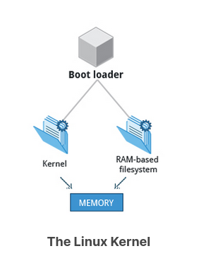

When the kernel is loaded in RAM, it immediately initializes and configures the computer’s memory and also configures all the hardware attached to the system. This includes all processors, I/O subsystems, storage devices, etc. The kernel also loads some necessary user space applications.

<h3>/sbin/init and Services</h3>

Once the kernel has set up all its hardware and mounted the root filesystem, the kernel runs /sbin/init. This then becomes the initial process, which then starts other processes to get the system running. Most other processes on the system trace their origin ultimately to init; exceptions include the so-called kernel processes. These are started by the kernel directly, and their job is to manage internal operating system details.

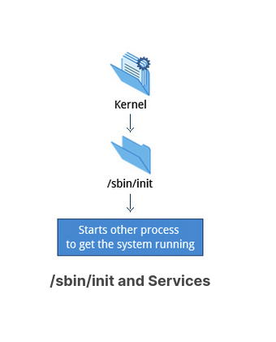

Besides starting the system, init is responsible for keeping the system running and for shutting it down cleanly. One of its responsibilities is to act when necessary as a manager for all non-kernel processes; it cleans up after them upon completion, and restarts user login services as needed when users log in and out, and does the same for other background system services.

Traditionally, this process startup was done using conventions that date back to the 1980s and the System V variety of UNIX. This serial process had the system passing through a sequence of runlevels containing collections of scripts that start and stop services. Each runlevel supported a different mode of running the system. Within each runlevel, individual services could be set to run, or to be shut down if running.

However, all major distributions have moved away from this sequential runlevel method of system initialization, although they usually emulate many System V utilities for compatibility purposes. Next, we discuss the new methods, of which systemd has become dominant.

<h3>Startup Alternatives</h3>

SysVinit viewed things as a serial process, divided into a series of sequential stages. Each stage required completion before the next could proceed. Thus, startup did not easily take advantage of the parallel processing that could be done on multiple processors or cores.

Furthermore, shutdown and reboot was seen as a relatively rare event; exactly how long it took was not considered important. This is no longer true, especially with mobile devices and embedded Linux systems. Some modern methods, such as the use of containers, can require almost instantaneous startup times. Thus, systems now require methods with faster and enhanced capabilities. Finally, the older methods required rather complicated startup scripts, which were difficult to keep universal across distribution versions, kernel versions, architectures, and types of systems. The two main alternatives developed were:

Upstart

            Developed by Ubuntu and first included in 2006
            Adopted in Fedora 9 (in 2008) and in RHEL 6 and its clones

systemd

            Adopted by Fedora first (in 2011)
            Adopted by RHEL 7 and SUSE 
            Replaced Upstart in Ubuntu 16.04

While the migration to systemd was rather controversial, it has been adopted by all major distributions, and so we will not discuss the older System V method or Upstart, which has become a dead end. Regardless of how one feels about the controversies or the technical methods of systemd, almost universal adoption has made learning how to work on Linux systems simpler, as there are fewer differences among distributions. We enumerate systemd features next.

<h3>systemd Features</h3>

Systems with systemd start up faster than those with earlier init methods. This is largely because it replaces a serialized set of steps with aggressive parallelization techniques, which permits multiple services to be initiated simultaneously.

Complicated startup shell scripts are replaced with simpler configuration files, which enumerate what has to be done before a service is started, how to execute service startup, and what conditions the service should indicate have been accomplished when startup is finished. One thing to note is that /sbin/init now just points to /lib/systemd/systemd; i.e. systemd takes over the init process.

One systemd command (systemctl) is used for most basic tasks. While we have not yet talked about working at the command line, here is a brief listing of its use:

- Starting, stopping, restarting a service (using httpd, the Apache web server, as an example) on a currently running system:
    `$ sudo systemctl start|stop|restart httpd.service`
- Enabling or disabling a system service from starting up at system boot:
            `$ sudo systemctl enable|disable httpd.service`

    In most cases, the .service can be omitted. There are many technical differences with older methods that lie beyond the scope of our discussion.  

<h3>Linux Filesystems</h3>

Think of a refrigerator that has multiple shelves that can be used for storing various items. These shelves help you organize the grocery items by shape, size, type, etc. The same concept applies to a filesystem, which is the embodiment of a method of storing and organizing arbitrary collections of data in a human-usable form.

Different types of filesystems supported by Linux:

- Conventional disk filesystems: ext3, ext4, XFS, Btrfs, JFS, NTFS, vfat, exfat, etc.
- Flash storage filesystems: ubifs, jffs2, yaffs, etc.
- Database filesystems
- Special purpose filesystems: procfs, sysfs, tmpfs, squashfs, debugfs, fuse, etc.

This section will describe the standard filesystem layout shared by most Linux distributions.

<h3>Partitions and Filesystems</h3>

A partition is a physically contiguous section of a disk, or what appears to be so in some advanced setups.

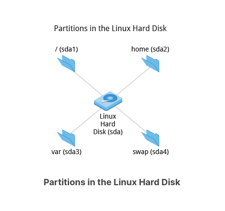

A filesystem is a method of storing/finding files on a hard disk (usually in a partition).

One can think of a partition as a container in which a filesystem resides, although in some circumstances, a filesystem can span more than one partition if one uses symbolic links, which we will discuss much later.

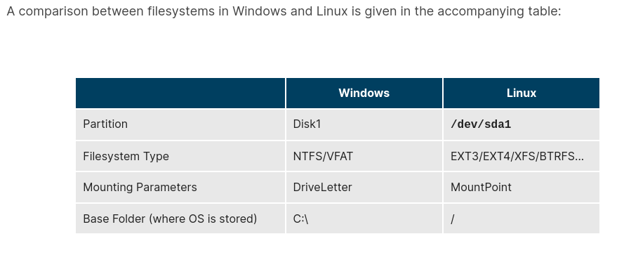

<h3>The Filesystem Hierarchy Standard</h3>

Linux systems store their important files according to a standard layout called the Filesystem Hierarchy Standard (FHS), which has long been maintained by the Linux Foundation. For more information, take a look at the following document: "Filesystem Hierarchy Standard" created by LSB Workgroup. Having a standard is designed to ensure that users, administrators, and developers can move between distributions without having to re-learn how the system is organized.

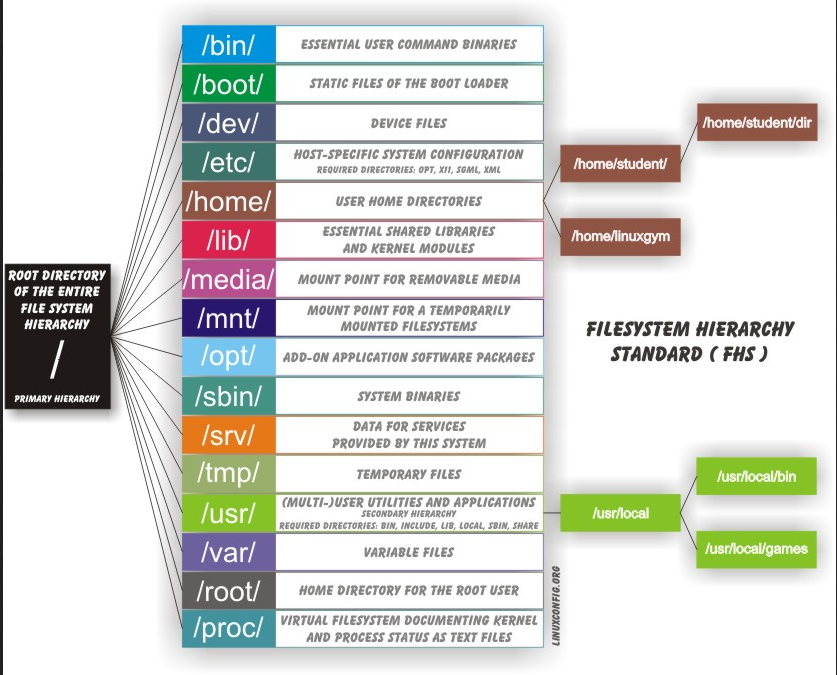

Linux uses the ‘/’ character to separate paths (unlike Windows, which uses ‘\’), and does not have drive letters. Multiple drives and/or partitions are mounted as directories in the single filesystem. Removable media such as USB drives and CDs and DVDs will show up as mounted at /run/media/yourusername/disklabel for recent Linux systems, or under /media for older distributions. For example, if your username is student a USB pen drive labeled FEDORA might end up being found at /run/media/student/FEDORA, and a file README.txt on that disc would be at /run/media/student/FEDORA/README.txt.

<h3>More About the Filesystem Hierarchy Standard</h3>

All Linux filesystem names are case-sensitive, so /boot, /Boot, and /BOOT represent three different directories (or folders). Many distributions distinguish between core utilities needed for proper system operation and other programs, and place the latter in directories under /usr (think user). To get a sense for how the other programs are organized, find the /usr directory in the diagram from the previous page and compare the subdirectories with those that exist directly under the system root directory (/).

<h3>Questions to Ask When Choosing a Distribution</h3>

Some questions worth thinking about before deciding on a distribution include:

- What is the main function of the system (server or desktop)?
- What types of packages are important to the organization? For example, web server, word processing, etc.
- How much hard disk space is required and how much is available? For example, when installing Linux on an embedded device, space is usually constrained.
- How often are packages updated?
- How long is the support cycle for each release? For example, LTS releases have long-term support.
- Do you need kernel customization from the vendor or a third party?
- What hardware are you running on? For example, it might be X86, ARM, PPC, etc.
- Do you need long-term stability? Can you accept (or need) a more volatile cutting edge system running the latest software?

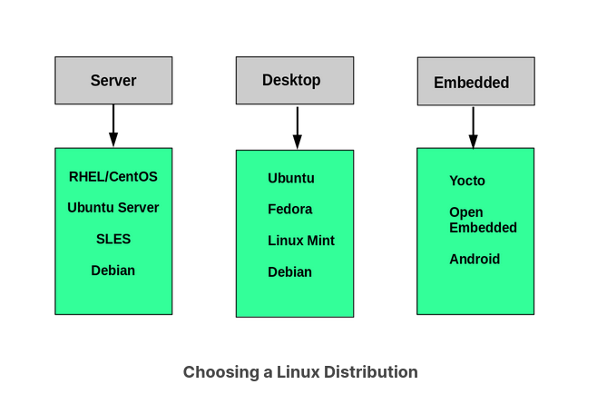

<h3>Linux Installation: Planning</h3>

The partition layout needs to be decided at the time of installation; it can be difficult to change later. While Linux systems handle multiple partitions by mounting them at specific points in the filesystem, and you can always modify the design later, it is always easier to try and get it right to begin with.

Nearly all installers provide a reasonable default layout, with either all space dedicated to normal files on one big partition and a smaller swap partition, or with separate partitions for some space-sensitive areas like /home and /var. You may need to override the defaults and do something different if you have special needs, or if you want to use more than one disk.

<h3>Linux Installation: Software Choices</h3>

All installations include the bare minimum software for running a Linux distribution.

Most installers also provide options for adding categories of software. Common applications (such as the Firefox web browser and LibreOffice office suite), developer tools (like the vi and emacs text editors, which we will explore later in this course), and other popular services, (such as the Apache web server tools or MySQL database) are usually included. In addition, for any system with a graphical desktop, a chosen desktop (such as GNOME or KDE) is installed by default.

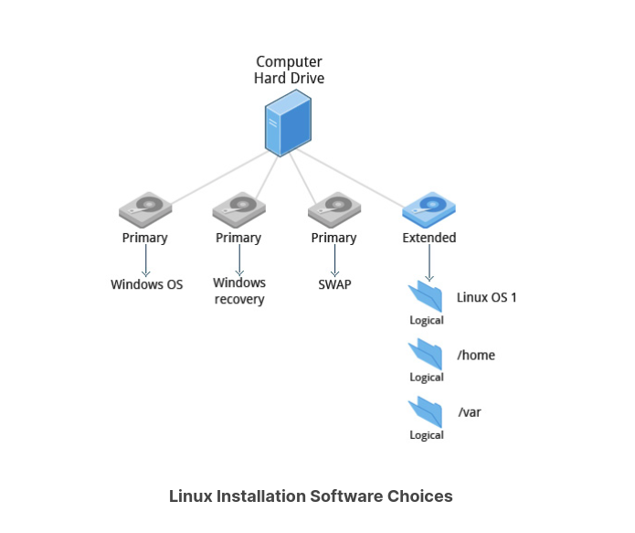

All installers set up some initial security features on the new system. One basic step consists of setting the password for the superuser (root) and setting up an initial user. In some cases (such as Ubuntu), only an initial user is set up; direct root login is not configured and root access requires logging in first as a normal user and then using sudo, as we will describe later. Some distributions will also install more advanced security frameworks, such as SELinux or AppArmor. For example, all Red Hat-based systems including Fedora and CentOS always use SELinux by default, and Ubuntu comes with AppArmor up and running.

<h3>Linux Installation: Install Source</h3>

Like other operating systems, Linux distributions are provided on removable media such as USB drives and CDs or DVDs. Most Linux distributions also support booting a small image and downloading the rest of the system over the network. These small images are usable on media, or as network boot images, in which case it is possible to perform an install without using any local media.

Many installers can do an installation completely automatically, using a configuration file to specify installation options. This file is called a Kickstart file for Red Hat-based systems, an AutoYAST profile for SUSE-based systems, and a Preseed file for Debian-based systems.

Each distribution provides its own documentation and tools for creating and managing these files.

<h3>Linux Installation: The Process</h3>

The actual installation process is pretty similar for all distributions.

After booting from the installation media, the installer starts and asks questions about how the system should be set up. These questions are skipped if an automatic installation file is provided. Then, the installation is performed.

Finally, the computer reboots into the newly-installed system. On some distributions, additional questions are asked after the system reboots.

Most installers have the option of downloading and installing updates as part of the installation process; this requires Internet access. Otherwise, the system uses its normal update mechanism to retrieve those updates after the installation is done.

<b>NOTE</b>: <i>We will be demonstrating the installation process in each of the three Linux distribution families we cover in this course. You can view a demonstration for the distribution type of your choice.</i>

<h3>Linux Installation: The Warning</h3>

<b>IMPORTANT!</b>

The demonstrations show how to install Linux directly on your machine, erasing everything that was there. While the demonstrations will not alter your computer, following these procedures in real life will erase all current data.

The Linux Foundation has a document: "Preparing Your Computer for Linux Training" (see below) that describes alternate methods of installing Linux without over-writing existing data. You may want to consult it, if you need to preserve the information on your hard disk.

These alternate methods are:

1. Re-partitioning your hard disk to free up enough room to permit dual boot (side-by-side) installation of Linux, along with your present operating system.
2. Using a host machine hypervisor program (such as VMWare's products or Oracle Virtual Box) to install a client Linux Virtual Machine.
3. Booting off of and using a Live CD or USB stick and not writing to the hard disk at all.

The first method is sometimes complicated and should be done when your confidence is high and you understand the steps involved. The second and third methods are quite safe and make it difficult to damage your system.

<h3>Chapter Summary</h3>

You have completed Chapter 3. Let’s summarize the key concepts covered:

- A partition is a logical part of the disk.
- A filesystem is a method of storing/finding files on a hard disk.
- By dividing the hard disk into partitions, data can be grouped and separated as needed. When a failure or mistake occurs, only the data in the affected partition will be damaged, while the data on the other partitions will likely survive.
- The boot process has multiple steps, starting with BIOS, which triggers the boot loader to start up the Linux kernel. From there, the initramfs filesystem is invoked, which triggers the init program to complete the startup process.
- Determining the appropriate distribution to deploy requires that you match your specific system needs to the capabilities of the different distributions.

<h3>Learning Objectives</h3>

By the end of this chapter, you should be able to:

- Manage graphical interface sessions.
- Perform basic operations using the graphical interface.
- Change the graphical desktop to suit your needs.

### Graphical Desktop

You can use either a Command Line Interface (CLI) or a Graphical User Interface (GUI) when using Linux. To work at the CLI, you have to remember which programs and commands are used to perform tasks, and how to quickly and accurately obtain more information about their use and options. On the other hand, using the GUI is often quick and easy. It allows you to interact with your system through graphical icons and screens. For repetitive tasks, the CLI is often more efficient, while the GUI is easier to navigate if you do not remember all the details or do something only rarely. 

We will learn how to manage sessions using the GUI for the three Linux distribution families that we cover the most in this course: Red Hat (CentOS, Fedora), SUSE (openSUSE), and Debian (Ubuntu, Mint). Since we are using the GNOME-based variant of openSUSE rather than the KDE-based one, all are actually quite similar. If you are using KDE (or other Linux desktops such as XFCE), your experience will vary somewhat from what is shown, but not in any intrinsically difficult way, as user interfaces have converged to certain well-known behaviors on modern operating systems. In subsequent sections of this course we will concentrate in great detail on the command line interface, which is pretty much the same on all distributions.

### X Window System

Generally, in a Linux desktop system, the X Window System is loaded as one of the final steps in the boot process. It is often just called X.

A service called the Display Manager keeps track of the displays being provided and loads the X server (so-called, because it provides graphical services to applications, sometimes called X clients). The display manager also handles graphical logins and starts the appropriate desktop environment after a user logs in.

X is rather old software; it dates back to the mid 1980s and, as such, has certain deficiencies on modern systems (for example, with security), as it has been stretched rather far from its original purposes. A newer system, known as Wayland, is gradually superseding it and is the default display system for Fedora, RHEL 8, and other recent distributions.  For the most part, it looks just like X to the user, although under the hood it is quite different.

### More About X

A desktop environment consists of a session manager, which starts and maintains the components of the graphical session, and the window manager, which controls the placement and movement of windows, window title-bars, and controls.

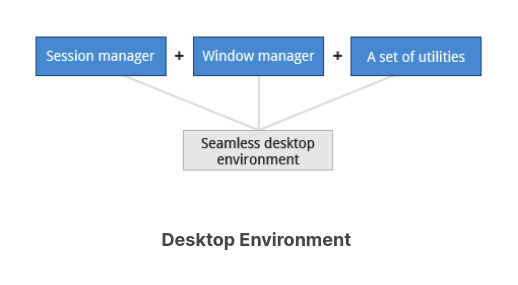

Although these can be mixed, generally a set of utilities, session manager, and window manager are used together as a unit, and together provide a seamless desktop environment.

If the display manager is not started by default in the default runlevel, you can start the graphical desktop different way, after logging on to a text-mode console, by running startx from the command line. Or, you can start the display manager (gdm, lightdm, kdm, xdm, etc.) manually from the command line. This differs from running startx as the display managers will project a sign in screen. We discuss them next.

### GUI Startup

When you install a desktop environment, the X display manager starts at the end of the boot process. It is responsible for starting the graphics system, logging in the user, and starting the user’s desktop environment. You can often select from a choice of desktop environments when logging in to the system.

The default display manager for GNOME is called gdm. Other popular display managers include lightdm (used on Ubuntu before version 18.04 LTS) and kdm (associated with KDE).

### GNOME Desktop Environment

GNOME is a popular desktop environment with an easy-to-use graphical user interface. It is bundled as the default desktop environment for most Linux distributions, including Red Hat Enterprise Linux (RHEL), Fedora, CentOS, SUSE Linux Enterprise, Ubuntu and Debian. GNOME has menu-based navigation and is sometimes an easy transition to accomplish for Windows users. However, as you will see, the look and feel can be quite different across distributions, even if they are all using GNOME.

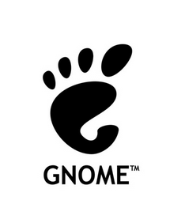

Another common desktop environment very important in the history of Linux and also widely used is KDE, which has often been used in conjunction with SUSE and openSUSE. Other alternatives for a desktop environment include Unity (present on older Ubuntu, but still based on GNOME), XFCE and LXDE. As previously mentioned, most desktop environments follow a similar structure to GNOME, and we will restrict ourselves mostly to it to keep things less complex.

### Graphical Desktop Background

Each Linux distribution comes with its own set of desktop backgrounds. You can change the default by choosing a new wallpaper or selecting a custom picture to be set as the desktop background. If you do not want to use an image as the background, you can select a color to be displayed on the desktop instead.

In addition, you can also change the desktop theme, which changes the look and feel of the Linux system. The theme also defines the appearance of application windows.

### Customizing the Desktop Background

To change the background, you can right click anywhere on the desktop and choose Change Background. 

### gnome-tweaks

Most common settings, both personal and system-wide, are to be found by clicking in the upper right-hand corner, on either a gear or other obvious icon, depending on your Linux distribution.

However, there are many settings which many users would like to modify which are not thereby accessible; the default settings utility is unfortunately rather limited in modern GNOME-based distributions. Unfortunately, the quest for simplicity has actually made it difficult to adapt your system to your tastes and needs.  

Fortunately, there is a standard utility, gnome-tweaks, which exposes many more setting options. It also permits you to easily install extensions by external parties. Not all Linux distributions install this tool by default, but it is always available (older distributions used the name gnome-tweak-tool). You may have to run it by hitting Alt-F2 and then typing in the name. You may want to add it to your Favorites list as we shall discuss.

As discussed in the next chapter, some recent distributions have taken most of the functionality out of this tool and placed it in a new one, called gnome-extensions-app.

In the screenshot below, the keyboard mapping is being adjusted so the useless CapsLock key can be used as an additional Ctrl key; this saves users who use Ctrl a lot (such as emacs aficionados) from getting physically damaged by pinkie strain.

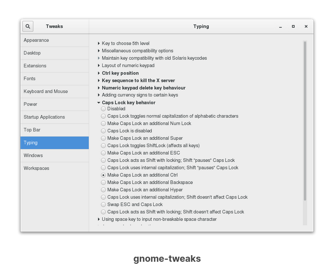

### Changing the Theme

The visual appearance of applications (the buttons, scroll bars, widgets, and other graphical components) are controlled by a theme. GNOME comes with a set of different themes which can change the way your applications look. 

The exact method for changing your theme may depend on your distribution. For older GNOME-based distributions, you can simply run gnome-tweaks, as shown in the screenshot from Ubuntu. However, as mentioned earlier, if you don't find it there, you will need to look at gnome-extensions-app, which can now configure themes. This requires installing even more software and going to external websites, so it is unlikely to be seen as an improvement by many users.

There are other options to get additional themes beyond the default selection. You can download and install themes from the GNOME's Wiki website.

### Lab 4.1: Customizing the Desktop

Despite the length of this section, we will not do very elaborate step-by-step lab exercises, because of the diversity of Linux distributions and versions, and because they each customize their desktops, even if the underlying code base is the same. Trying to give exact instructions is an exercise in futility; not only are there many variations, they are susceptible to change every time a new version of a Linux distribution is released.

For the most part, this is not a problem. Graphical interfaces are designed to be easy to navigate and figure out, and they really do not vary very much, not only from one distribution to another, but even between operating systems. So, the only way you can get more adept at working efficiently on your desktop is to simply explore, play, and modify. The same points will apply to the next chapter, on graphical system configuration.

Linux is so customizable that very few people who use it stay with the default look and feel of the desktop. You may as well get started now in making your desktop reflect your likes and personality.

- Start by changing the desktop background to something that better suits yours tastes; perhaps one of the provided backgrounds, a solid color of your choice, or a personal picture that you can transfer onto your Linux environment.
- Next, select a theme from the available themes for your distribution that, again, suits your tastes and personality. Have fun and explore with this exercise.

Click the link below to view a solution to the Lab exercise.

### Logging In and Out

The next screen shows a demonstration for logging in and out on the major Linux distribution families we concentrate on in this course. Note that evolution has brought us to a stage where it little matters which distribution you choose, as they are all rather similar.

### Locking the Screen

It is often a good idea to lock your screen to prevent other people from accessing your session while you are away from your computer.

<i><b>NOTE</b>: This does not suspend the computer; all your applications and processes continue to run while the screen is locked.</i>

There are two ways to lock your screen:

- Using the graphical interface
Clicking in the upper-right corner of the desktop, and then clicking on the lock icon.
- Using the keyboard shortcut SUPER-L 
(The SUPER key is also known as the Windows key). 

The keyboard shortcut for locking the screen can be modified by altering keyboard settings, the exact prescription varying by distribution, but not hard to ascertain.

To re-enter the desktop session you just need to provide your password again.

The screenshot below shows how to lock the screen for Ubuntu. The details vary little in modern distributions.

### Switching Users

Linux is a true multi-user operating system, which allows more than one user to be simultaneously logged in. If more than one person uses the system, it is best for each person to have their own user account and password. This allows for individualized settings, home directories, and other files. Users can take turns using the machine, while keeping everyone's sessions alive, or even be logged in simultaneously through the network.

### Shutting Down and Restarting

Besides normal daily starting and stopping of the computer, a system restart may be required as part of certain major system updates, generally only those involving installing a new Linux kernel.

Initiating the shutdown process from the graphical desktop is rather trivial on all current Linux distributions, with very little variation. We will discuss later how to do this from the command line, using the shutdown command.

In all cases, you click on either a settings (gear) or a power icon and follow the prompts. 

### Shutting Down and Restarting on GNOME

To shut down the computer in any recent GNOME-based Linux distribution, perform the following steps:

1. Click either the Power or the Gear icon in the upper-right corner of the screen.
2. Click on Power Off, Restart, or Cancel. If you do nothing, the system will shutdown in 60 seconds.

Shutdown, reboot, and logout operations will ask for confirmation before going ahead. This is because many applications will not save their data properly when terminated this way.

Always save your documents and data before restarting, shutting down, or logging out. 

### Suspending

All modern computers support Suspend (or Sleep) Mode when you want to stop using your computer for a while. Suspend Mode saves the current system state and allows you to resume your session more quickly while remaining on, but uses very little power in the sleeping state. It works by keeping your system’s applications, desktop, and so on, in system RAM, but turning off all of the other hardware. This shortens the time for a full system start-up as well as conserves battery power. One should note that modern Linux distributions actually boot so fast that the amount of time saved is often minor.

### Suspending the System

To suspend the system, the procedure starts the same as that for shutdown or locking the screen.  

The method is quite simple and universal in most recent GNOME-based distributions. If you click on the Power icon and hold for a short time and release, you will get the double line icon displayed below, which you then click to suspend the system. Some distributions, including Ubuntu, may still show a separate Suspend icon instead of using the above method.

<i><b>NOTE</b>: To wake your system and resume your session, move the mouse or press any button on the keyboard. The system will wake up with the screen locked, just as if you had manually locked it; type in your password to resume.</i>

### Basic Operations

Even experienced users can forget the precise command that launches an application, or exactly what options and arguments it requires. Fortunately, Linux allows you to quickly open applications using the graphical interface.

Applications are found at different places in Linux (and within GNOME):

- From the Applications menu in the upper-left corner.
- From the Activities menu in the upper-left corner.
- In some Ubuntu versions, from the Dash button in the upper-left corner.
- For KDE, and some other environments, applications can be opened from the button in the lower-left corner.

### Locating Applications

Unlike other operating systems, the initial install of Linux usually comes with a wide range of applications and software archives that contain thousands of programs that enable you to accomplish a wide variety of tasks with your computer. For most key tasks, a default application is usually already installed. However, you can always install more applications and try different options.

For example, Firefox is popular as the default browser in many Linux distributions, while Epiphany, Konqueror, and Chromium (the open source base for Google Chrome) are usually available for install from software repositories. Proprietary web browsers, such as Opera and Chrome, are also available.

Locating applications from the GNOME and KDE menus is easy, as they are neatly organized in functional submenus.

### Default Applications

Multiple applications are available to accomplish various tasks and to open a file of a given type. For example, you can click on a web address while reading an email and launch a browser such as Firefox or Chrome.

To set default applications, enter the Settings menu (on all recent Linux distributions) and then click on either Default Applications or Details > Default Applications. The exact list will vary from what is shown here in the Ubuntu screenshot according to what is actually installed and available on your system.

### File Manager

Each distribution implements the Nautilus (File Manager) utility, which is used to navigate the file system. It can locate files and, when a file is clicked upon, either it will run if it is a program, or an associated application will be launched using the file as data. This behavior is completely familiar to anyone who has used other operating systems.

To start the file manager you will have to click on its icon (a file cabinet) which is easily found, usually under Favorites or Accessories. It will have the name Files.

This will open a window with your Home directory displayed. The left panel of the File Manager window holds a list of commonly used directories, such as Desktop, Documents, Downloads and Pictures.

You can click the Magnifying Glass icon on the top-right to search for files or directories (folders).

### Home Directories

The File Manager lets you access different locations on your computer and the network, including the <b>Home</b> directory, <b>Desktop, Documents, Pictures,</b> and other <b>Other Locations</b>. 

Every user with an account on the system will have a home directory, usually created under <b>/home</b>, and usually named according to the user, such as <b>/home/student</b>.

By default, files the user saves will be placed in a directory tree starting there. Account creation, whether during system installation or at a later time, when a new user is added, also induces default directories to be created under the user's home directory, such as Documents, Desktop, and Downloads.

In the screenshot shown for Ubuntu, we have chosen the list format and are also showing hidden files (those starting with a period). See if you can do the same on your distribution.

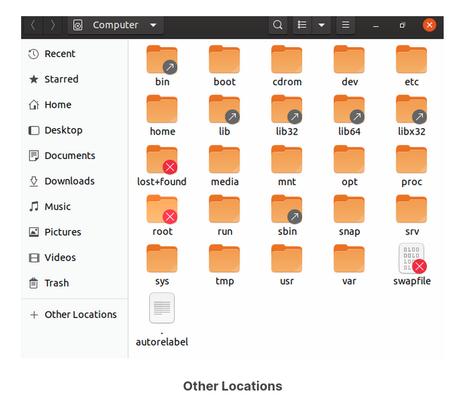

### Viewing Files

The File Manager allows you to view files and directories in more than one way.

You can switch between the Icons and List formats, either by clicking the familiar icons in the top bar, or you can press CTRL-1 or CTRL-2 respectively.

In addition, you can also arrange the files and directories by name, size, type, or modification date for further sorting. To do so, click View and select Arrange Items.

Another useful option is to show hidden files (sometimes imprecisely called system files), which are usually configuration files that are hidden by default and whose name starts with a dot. To show hidden files, select Show Hidden Files from the menu or press CTRL-H.

The file browser provides multiple ways to customize your window view to facilitate easy drag and drop file operations. You can also alter the size of the icons by selecting Zoom In and Zoom Out under the View menu.

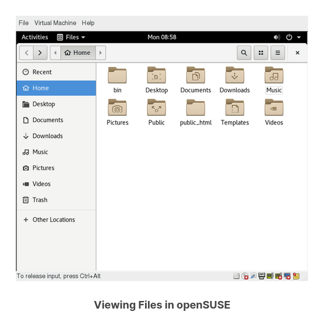

### Searching for Files

The File Manager includes a great search tool inside the file browser window.

1. Click Search in the toolbar (to bring up a text box).
2. Enter the keyword in the text box. This causes the system to perform a recursive search from the current directory for any file or directory which contains a part of this keyword.

To open the File Manager from the command line, on most systems simply type nautilus.

The shortcut key to get to the search text box is CTRL-F. You can exit the search text box view by clicking the Search button or CTRL-F again.

Another quick way to access a specific directory is to press CTRL-L, which will give you a Location text box to type in a path to a directory.

### More About Searching for Files

You can refine your search beyond the initial keyword by providing dropdown menus to further filter the search.

1. Based on Location or File Type, select additional criteria from the dropdown.
2. To regenerate the search, click the Reload button.
3. To add multiple search criteria, click the + button and select Additional Search Criteria.

For example, if you want to find a PDF file containing the word Linux in your home directory, navigate to your home directory and search for the word “Linux”. You should see that the default search criterion limits the search to your home directory already. To finish the job, click the + button to add another search criterion, select File Type for the type of criterion, and select PDF under the File Type dropdown.

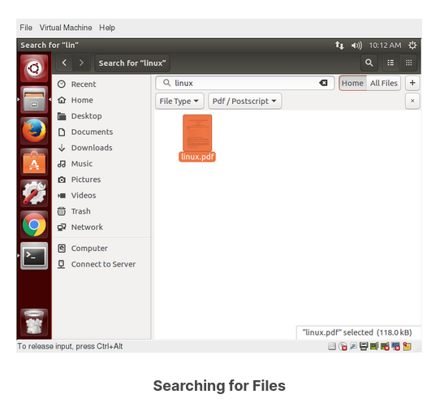

### Editing a File

Editing any text file through the graphical interface is easy in the GNOME desktop environment. Simply double-click the file on the desktop or in the Nautilus file browser window to open the file with the default text editor.

The default text editor in GNOME is gedit. It is simple yet powerful, ideal for editing documents, making quick notes, and programming. Although gedit is designed as a general purpose text editor, it offers additional features for spell checking, highlighting, file listings and statistics.

### Removing a File

Deleting a file in Nautilus will automatically move the deleted files to the .local/share/Trash/files/ directory (a trash can of sorts) under the user's home directory. There are several ways to delete files and directories using Nautilus.

1. Select all the files and directories that you want to delete.
2. Press CTRL-Delete on your keyboard, or right-click the file.
3. Select Move to Trash.

Note that you may have a Delete Permanently option which bypasses the trash folder, and that this option may be visible all the time or only in list (rather than) icon mode.

### More About Removing a File

To permanently delete a file:

1. On the left panel inside a Nautilus file browser window, right-click on the Trash directory.
2. Select Empty Trash.

Alternatively, select the file or directory you want to permanently delete and press Shift-Delete.

As a precaution, you should never delete your Home directory, as doing so will most likely erase all your GNOME configuration files and possibly prevent you from logging in. Many personal system and program configurations are stored under your home directory.

### Chapter Summary

You have completed Chapter 4. Let's summarize the key concepts covered:

- GNOME is a popular desktop environment and graphical user interface that runs on top of the Linux operating system.
- The default display manager for GNOME is called gdm.
- The gdm display manager presents the user with the login screen, which prompts for the login username and password.
- Logging out through the desktop environment kills all processes in your current X session and returns to the display manager login screen.
- Linux enables users to switch between logged-in sessions.
- Suspending puts the computer into sleep mode.
- For each key task, there is generally a default application installed.
- Every user created in the system will have a home directory.
- The Places menu contains entries that allow you to access different parts of the computer and the network.
- Nautilus gives three formats to view files.
- Most text editors are located in the Accessories submenu.
- Each Linux distribution comes with its own set of desktop backgrounds.
- GNOME comes with a set of different themes which can change the way your applications look.

### System Settings

The System Settings panel allows you to control most of the basic configuration options and desktop settings, such as specifying the screen resolution, managing network connections, or changing the date and time of the system.

For the GNOME Desktop Manager, one clicks on the upper right-hand corner and then selects the tools image (screwdriver crossed with a wrench or a gear). Depending on your distribution, you may find other ways to get into the settings configuration as well. You will also find variation in the menu layout between Linux distributions and versions, so you may have to hunt for the settings you need to examine or modify.

### System Settings Menus

To get deeper into configuration, one can click on the Devices on the previous menu in order to configure items like the display, the keyboard, the printers, etc.

One can also click on the Users icon (which may be under Details) to set values for system users, such as their login picture, password, etc.

### gnome-tweaks

A lot of personalized configuration settings do not appear on the settings menus. Instead, you have to launch a tool called either gnome-tweaks (or gnome-tweak-tool on older Linux distributions). We have not really discussed working at the command line yet, but you can always launch a program such as this by doing Alt-F2 and typing in the command. Some distributions have a link to the tweaks menus in the settings, but for some mysterious reason, many obscure this tool's existence, and it becomes hard to discover how to modify even rather basic desktop attributes and behavior.

Important things you can do with this tool include selecting a theme, configuring extensions which you can get from your distribution or download from the Internet, control fonts, modify the keyboard layout, and set which programs start when you login.

The most recent GNOME versions have removed a lot of the functionality of gnome-tweaks; extensions now have to be configured using a new app called gnome-extensions-app. The reasoning for this is obscure.

The screenshot here is from a Red Hat system with quite a few extensions installed, but not all being used.

### Display Settings

Clicking on Settings > Displays (or Settings > Devices > Displays) will expose the most common settings for changing  the desktop appearance. These settings function independently of the specific display drivers you are running. The exact appearance will depend enormously on how many monitors you have and other factors, such as Linux distribution and particular version.

If your system uses a proprietary video card driver (usually from nVidia or AMD), you will probably have a separate configuration program for that driver. This program may give more configuration options, but may also be more complicated, and might require sysadmin (root) access. If possible, you should configure the settings in the Displays panel rather than with the proprietary program.

The X server, which actually provides the GUI, uses /etc/X11/xorg.conf as its configuration file if it exists; In modern Linux distributions, this file is usually present only in unusual circumstances, such as when certain less common graphic drivers are in use. Changing this configuration file directly is usually for more advanced users.

### Setting Resolution and Configuring Multiple Screens

While your system will usually figure out the best resolution for your screen automatically, it may get this wrong in some cases, or you might want to change the resolution to meet your needs.

You can accomplish this using the Displays panel. The switch to the new resolution will be effective when you click Apply, and then confirm that the resolution is working. In case the selected resolution fails to work or you are just not happy with the appearance, the system will switch back to the original resolution after a short timeout. Once again, the exact appearance of the configuration screen will vary a lot between distributions and versions, but usually is rather intuitive and easy, once you find the configuration menus.

In most cases, the configuration for multiple displays is set up automatically as one big screen spanning all monitors, using a reasonable guess for screen layout. If the screen layout is not as desired, a check box can turn on mirrored mode, where the same display is seen on all monitors. Clicking on a particular monitor image lets you configure the resolution of each one, and whether they make one big screen, or mirror the same video, etc.

### Date and Time Settings

By default, Linux always uses Coordinated Universal Time (UTC) for its own internal timekeeping. Displayed or stored time values rely on the system time zone setting to get the proper time. UTC is similar to, but more accurate than, Greenwich Mean Time (GMT).

If you click on the time displayed on the top panel, you can adjust the format with which the date and time is shown; on some distributions, you can also alter the values.

The more detailed date and time settings can be selected from the Date & Time window in the System Settings Menu.

The "automatic" settings are referring to the use of Network Time Protocol (NTP), which we discuss next.

### Network Time Protocol

The Network Time Protocol (NTP) is the most popular and reliable protocol for setting the local time by consulting established Internet servers. Linux distributions always come with a working NTP setup, which refers to specific time servers run or relied on by the distribution. This means that no setup, beyond "on" or "off", is generally required for network time synchronization.

#### Lab 5.1: Getting and Setting Screen Resolution

Find out the current screen resolution for your desktop.

Change it to something else, and change it back to its original value.

NOTE: You can also ascertain your current resolution by typing at the command line:

`student:/tmp> $ xdpyinfo | grep dim`
`dimensions: 3200x1080 pixels (847x286 millimeters)`

### Network Configuration

All Linux distributions have network configuration files, but file formats and locations can differ from one distribution to another. Hand editing of these files can handle quite complicated setups, but is not very dynamic or easy to learn and use. Network Manager was developed to make things easier and more uniform across distributions. It can list all available networks (both wired and wireless), allow the choice of a wired, wireless, or mobile broadband network, handle passwords, and set up Virtual Private Networks (VPNs). Except for unusual situations, it is generally best to let Network Manager establish your connections and keep track of your settings.

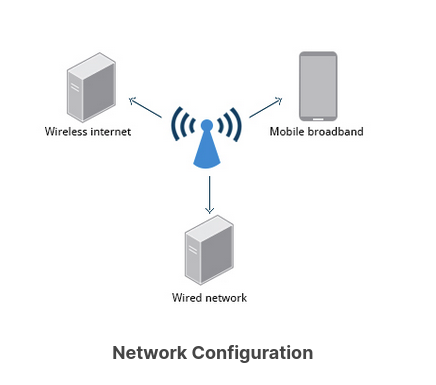

### Wired and Wireless Connections

Wired connections usually do not require complicated or manual configuration. The hardware interface and signal presence are automatically detected, and then Network Manager sets the actual network settings via Dynamic Host Configuration Protocol (DHCP).

For static configurations that do not use DHCP, manual setup can also be done easily through Network Manager. You can also change the Ethernet Media Access Control (MAC) address if your hardware supports it. The MAC address is a unique hexadecimal number of your network card.

Wireless networks are usually not connected by default. You can view the list of available wireless networks and see which one (if any) you are currently connected to by using Network Manager. You can then add, edit, or remove known wireless networks, and also specify which ones you want connected by default when present.

### Configuring Wireless Connections

To configure a wireless network in any recent GNOME-based distribution:

Click on the upper-right corner of the top panel, which brings up a settings and/or network window. While the exact appearance will depend on Linux distribution and version, it will always be possible to click on a Wi-Fi submenu, as long as the hardware is present.

Select the wireless network you wish to connect to. If it is a secure network, the first time it will request that you enter the appropriate password. By default, the password will be saved for subsequent connections.

If you click on Wi-Fi Settings, you will bring up the third screenshot. If you click on the Gear icon for any connection, you can configure it in more detail.

Older and other Linux distributions may look quite a bit different in detail, but the steps and choices are essentially identical, as they are all running Network Manager with perhaps somewhat different clothing.

### Mobile Broadband and VPN Connections

You can set up a mobile broadband connection with Network Manager, which will launch a wizard to set up the connection details for each connection.

Once the configuration is done, the network is configured automatically each time the broadband network is attached.

Network Manager can also manage your VPN connections.

It supports many VPN technologies, such as native IPSec, Cisco OpenConnect (via either the Cisco client or a native open source client), Microsoft PPTP, and OpenVPN.

You might get support for VPN as a separate package from your distributor. You need to install this package if your preferred VPN is not supported.

### Installing and Updating Software

Each package in a Linux distribution provides one piece of the system, such as the Linux kernel, the C compiler, utilities for manipulating text or configuring the network, or for your favorite web browsers and email clients.

Packages often depend on each other. For example, because your email client can communicate using SSL/TLS, it will depend on a package which provides the ability to encrypt and decrypt SSL and TLS communication, and will not install unless that package is also installed at the same time.

All systems have a lower-level utility which handles the details of unpacking a package and putting the pieces in the right places. Most of the time, you will be working with a higher-level utility which knows how to download packages from the Internet and can manage dependencies and groups for you.

In this section, you will learn how to install and update software in Linux using the Debian packaging system (used by systems such as Ubuntu as well) and RPM packaging systems (which is used by both Red Hat and SUSE family systems). These are the main ones in use although there are others which work well for other distributions which are less used.

### Debian Packaging

Let’s look at the Package Management for the Debian family system.

dpkg is the underlying package manager for these systems. It can install, remove, and build packages. Unlike higher-level package management systems, it does not automatically download and install packages and satisfy their dependencies.

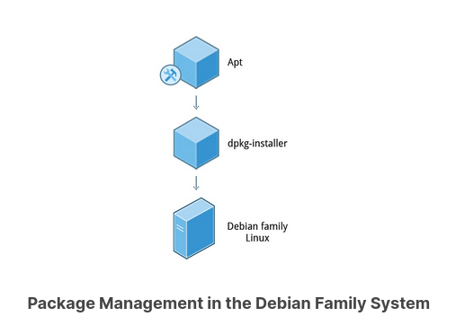

For Debian-based systems, the higher-level package management system is the Advanced Package Tool (APT) system of utilities. Generally, while each distribution within the Debian family uses APT, it creates its own user interface on top of it (for example, apt and apt-get, synaptic, gnome-software, Ubuntu Software Center, etc). Although apt repositories are generally compatible with each other, the software they contain generally is not. Therefore, most repositories target a particular distribution (like Ubuntu), and often software distributors ship with multiple repositories to support multiple distributions. Demonstrations are shown later in this section.

### Red Hat Package Manager (RPM)

Red Hat Package Manager (RPM) is the other package management system popular on Linux distributions. It was developed by Red Hat, and adopted by a number of other distributions, including SUSE/openSUSE, Mageia, CentOS, Oracle Linux, and others.

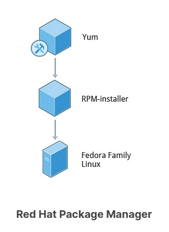

The higher-level package manager differs between distributions. Red Hat family distributions historically use RHEL/CentOS and Fedora uses dnf, while retaining good backwards compatibility with the older yum program. SUSE family distributions such as openSUSE also use RPM, but use the zypper interface.

### openSUSE’s YaST Software Management

The Yet another Setup Tool (YaST) software manager is similar to other graphical package managers. It is an RPM-based application. You can add, remove, or update packages using this application very easily. To access the YaST software manager:

1. Click Activities
2. In the Search box, type YaST
3. Click the YaST icon
4. Click Software Management

You can also find YaST by clicking on Applications > Other-YaST, which is a strange place to put it.

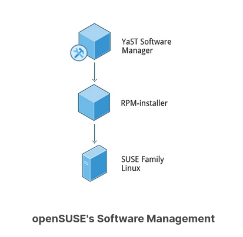

openSUSE’s YaST software management application is similar to the graphical package managers in other distributions. A demonstration of the YaST software manager is shown later in this section.

### Chapter Summary

You have completed Chapter 5. Let's summarize the key concepts covered:

- You can control basic configuration options and desktop settings through the System Settings panel.
- Linux always uses Coordinated Universal Time (UTC) for its own internal time-keeping. You can set the date and time settings from the System Settings window.
- The Network Time Protocol is the most popular and reliable protocol for setting the local time via Internet servers.
- The Displays panel allows you to change the resolution of your display and configure multiple screens.
- Network Manager can present available wireless networks, allow the choice of a wireless or mobile broadband network, handle passwords, and set up VPNs.
- dpkg and RPM are the most popular package management systems used on Linux distributions.
- Debian distributions use dpkg and apt-based utilities for package management.
- RPM was developed by Red Hat, and adopted by a number of other distributions, including the openSUSE, Mandriva, CentOS, Oracle Linux, and others.

### Internet Applications

he Internet is a global network that allows users around the world to perform multiple tasks, such as searching for data, communicating through emails and online shopping. Obviously, you need to use network-aware applications to take advantage of the Internet. These include:

- Web browsers
- Email clients
- Streaming media applications
- Internet Relay Chats
- Conferencing software

### Web Browsers

As discussed in the Graphical Interface chapter, Linux offers a wide variety of web browsers, both graphical and text-based, including:

- Firefox
- Google Chrome
- Chromium
- Epiphany (renamed web)
- Konqueror
- linx, lynx, w3m
- Opera

### Email Applications

Email applications allow for sending, receiving, and reading messages over the Internet. Linux systems offer a wide number of email clients, both graphical and text-based. In addition, many users simply use their browsers to access their email accounts.

Most email clients use the Internet Message Access Protocol (IMAP) or the older Post Office Protocol (POP) to access emails stored on a remote mail server. Most email applications also display HTML (HyperText Markup Language) formatted emails that display objects, such as pictures and hyperlinks. The features of advanced email applications include the ability of importing address books/contact lists, configuration information, and emails from other email applications.

Linux supports the following types of email applications:

- Graphical email clients, such as Thunderbird, Evolution, and Claws Mail.
- Text mode email clients, such as Mutt and mail.
- All web browser-based clients, such as Gmail, Yahoo Mail, and Office 365.

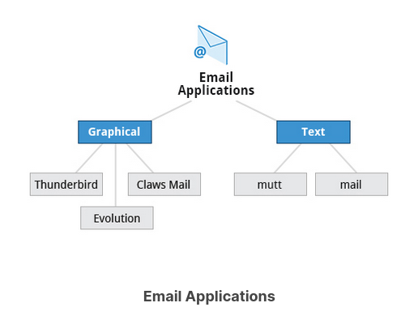

### Other Internet Applications

Linux systems provide many other applications for performing Internet-related tasks. These include:

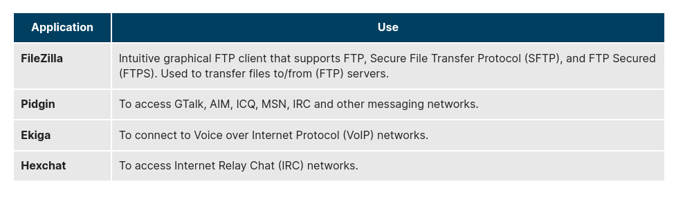

### Office Applications

Most day-to-day computer systems have productivity applications (sometimes called office suites) available or installed. Each suite is a collection of closely coupled programs used to create and edit different kinds of files such as:

- Text (articles, books, reports, etc.)
- Spreadsheets
- Presentations
- Graphical objects.

Most Linux distributions offer LibreOffice, an open source office suite that started in 2010 and has evolved from OpenOffice. While other office suites are available as we have listed, LibreOffice is the most mature, widely used and intensely developed.

In addition, Linux users have full access to Internet-based office suites such as Google Docs and Microsoft Office 365.

### LibreOffice Components

The component applications included in LibreOffice are:

- Writer: Word Processing
- Calc: Spreadsheets
- Impress: Presentations
- Draw: Create and edit graphics and diagrams.

The LibreOffice applications can read and write non-native document formats, such as those used by Microsoft Office. Usually, fidelity is maintained quite well, but complicated documents might have some imperfect conversions.

### Development Applications

Linux distributions come with a complete set of applications and tools that are needed by those developing or maintaining both user applications and the kernel itself.

These tools are tightly integrated and include:

- Advanced editors customized for programmers' needs, such as vi and emacs.
- Compilers (such as gcc and clang for programs in C and C++) for every computer language that has ever existed, including very popular new ones such as Golang and Rust.
- Debuggers such as gdb and various graphical front ends to it and many other debugging tools (such as Valgrind).
- Performance measuring and monitoring programs, some with easy to use graphical interfaces, others more arcane and meant to be used only by serious experienced development engineers.
- Complete Integrated Development Environments (IDE's) such as Eclipse and Visual Studio Code that put all these tools together.

On other operating systems, these tools have to be obtained and installed separately, often at a high cost, while on Linux they are all available at no cost through standard package installation systems.

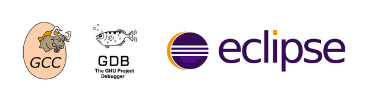

### Sound Players

Multimedia applications are used to listen to music, watch videos, etc., as well as to present and view text and graphics. Linux systems offer a number of sound player applications, including:

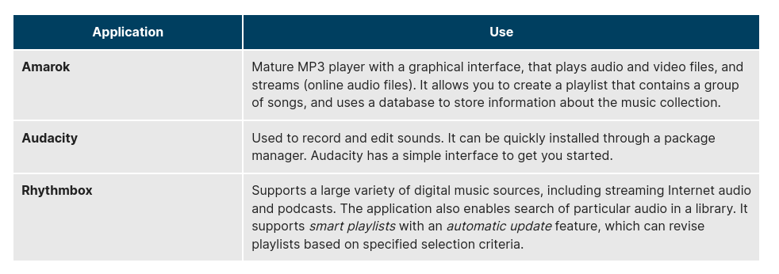

Of course, Linux systems can also connect with commercial online music streaming services, such as Pandora and Spotify through web browsers.

### Movie Players

Movie (video) players can portray input from many different sources, either local to the machine or on the Internet.

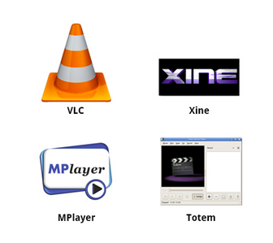

Linux systems offer a number of movie players, including:

- VLC
- MPlayer
- Xine
- Totem

### Movie Editors

Movie editors are used to edit videos or movies. Linux systems offer a number of movie editors, including: 

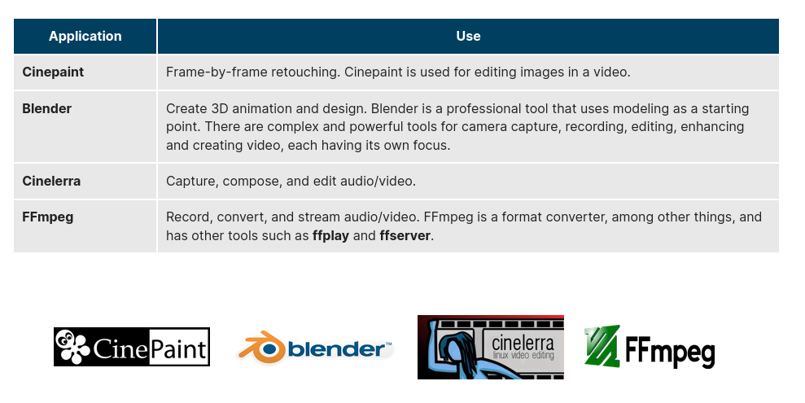

### GIMP (GNU Image Manipulation Program)

Graphic editors allow you to create, edit, view, and organize images of various formats, like Joint Photographic Experts Group (JPEG or JPG), Portable Network Graphics (PNG), Graphics Interchange Format (GIF), and Tagged Image File Format (TIFF).

The GNU Image Manipulation Program (GIMP) is a feature-rich image retouching and editing tool similar to Adobe Photoshop and is available on all Linux distributions. Some features of the GIMP are:

- It can handle any image file format.
- It has many special purpose plugins and filters.
- It provides extensive information about the image, such as layers, channels, and histograms.

### Graphics Utilities

In addition to GIMP, there are other graphics utilities that help perform various image-related tasks, including:

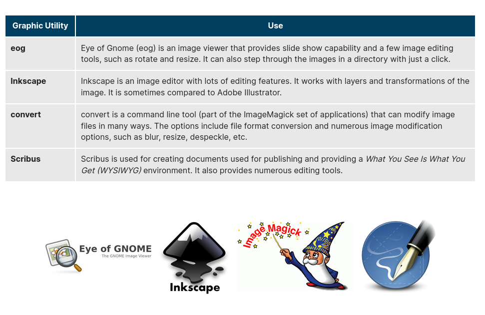

### Chapter Summary

You have completed Chapter 6. Let’s summarize the key concepts covered:

- Linux offers a wide variety of Internet applications, such as web browsers, email clients, online media applications, and others.
- Web browsers supported by Linux can be either graphical or text-based, such as Firefox, Google Chrome, Epiphany, w3m, lynx, and others.
- Linux supports graphical email clients, such as Thunderbird, Evolution, and Claws Mail, and text mode email clients, such as Mutt and mail.
- Linux systems provide many other applications for performing Internet-related tasks, such as Filezilla, XChat, Pidgin, and others.
- Most Linux distributions offer LibreOffice to create and edit different kinds of documents.
- Linux systems offer entire suites of development applications and tools, including compilers and debuggers.
- Linux systems offer a number of sound players including Amarok, Audacity, and Rhythmbox.
- Linux systems offer a number of movie players, including VLC, MPlayer, Xine, and Totem.
- Linux systems offer a number of movie editors, including Kino, Cinepaint, Blender among others.
- The GIMP (GNU Image Manipulation Program) utility is a feature-rich image retouching and editing tool available on all Linux distributions.
- Other graphics utilities that help perform various image-related tasks are eog, Inkscape, convert, and Scribus.

### Introduction to the Command Line

Linux system administrators spend a significant amount of their time at a command line prompt. They often automate and troubleshoot tasks in this text environment. There is a saying, "graphical user interfaces make easy tasks easier, while command line interfaces make difficult tasks possible". Linux relies heavily on the abundance of command line tools. The command line interface provides the following advantages:

- No GUI overhead is incurred.
- Virtually any and every task can be accomplished while sitting at the command line.
- You can implement scripts for often-used (or easy-to-forget) tasks and series of procedures.
- You can sign into remote machines anywhere on the Internet.
- You can initiate graphical applications directly from the command line instead of hunting through menus.
- While graphical tools may vary among Linux distributions, the command line interface does not.

### Using a Text Terminal on the Graphical Desktop

A terminal emulator program emulates (simulates) a standalone terminal within a window on the desktop. By this, we mean it behaves essentially as if you were logging into the machine at a pure text terminal with no running graphical interface. Most terminal emulator programs support multiple terminal sessions by opening additional tabs or windows.

By default, on GNOME desktop environments, the gnome-terminal application is used to emulate a text-mode terminal in a window. Other available terminal programs include:

- xterm
- konsole (default on KDE)
- terminator

### Launching Terminal Windows

To open a terminal on any system using a recent GNOME desktop click on Applications > System Tools > Terminal or Applications > Utilities > Terminal. If you do not have the Applications menu, you will have to install the appropriate gnome-shell-extension package and turn on with gnome-tweaks.

On any but some of the most recent GNOME-based distributions, you can always open a terminal by right-clicking anywhere on the desktop background and selecting Open in Terminal. If this does not work you will once again need to install and activate the appropriate gnome-shell-extension package.

You can also hit Alt-F2 and type in either gnome-terminal or konsole, whichever is appropriate.

Because distributions have had a history of burying opening up a command line terminal, and the place in menus may vary in the desktop GUI, It is a good idea to figure out how to "pin" the terminal icon to the panel, which might mean adding it to the Favorites grouping on GNOME systems.

### Some Basic Utilities

There are some basic command line utilities that are used constantly, and it would be impossible to proceed further without using some of them in simple form before we discuss them in more detail. A short list has to include:

- `cat`: used to type out a file (or combine files).
- `head`: used to show the first few lines of a file.
- `tail`: used to show the last few lines of a file.
- `man`: used to view documentation.

The screenshot shows elementary uses of these programs. Note the use of the pipe symbol (|) used to have one program take as input the output of another.

For the most part, we will only use these utilities in screenshots displaying various activities, before we discuss them in detail.

### The Command Line

Most input lines entered at the shell prompt have three basic elements:

- Command
- Options
- Arguments

The command is the name of the program you are executing. It may be followed by one or more options (or switches) that modify what the command may do. Options usually start with one or two dashes, for example, -p or --print, in order to differentiate them from arguments, which represent what the command operates on.

However, plenty of commands have no options, no arguments, or neither. In addition, other elements (such as setting environment variables) can also appear on the command line when launching a task.

### sudo

All the demonstrations created have a user configured with sudo capabilities to provide the user with administrative (admin) privileges when required. sudo allows users to run programs using the security privileges of another user, generally root (superuser). 

On your own systems, you may need to set up and enable sudo to work correctly. To do this, you need to follow some steps that we will not explain in much detail now, but you will learn about later in this course. When running on Ubuntu and some other recent distributions, sudo is already always set up for you during installation. On other Linux distributions, you will likely need to set up sudo to work properly for you after the initial installation.

Next, you will learn the steps to set up and run sudo on your system.

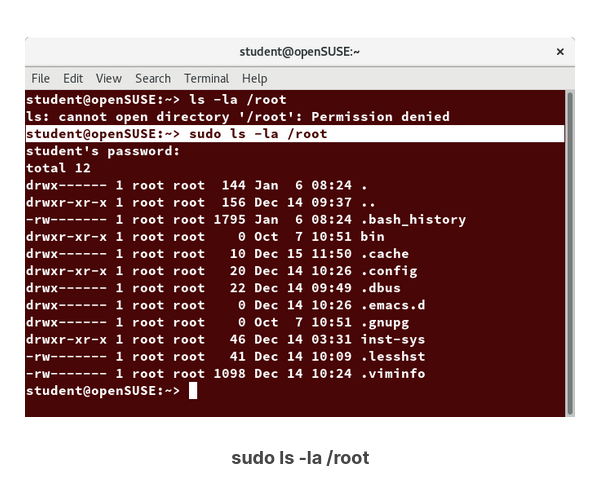

### Steps for Setting Up and Running sudo

If your system does not already have sudo set up and enabled, you need to do the following steps:

1. You will need to make modifications as the administrative, or superuser, root. While sudo will become the preferred method of doing this, we do not have it set up yet, so we will use su (which we will discuss later in detail) instead. At the command line prompt, type su and press Enter. You will then be prompted for the root password, so enter it and press Enter. You will notice that nothing is printed; this is so others cannot see the password on the screen. You should end up with a different looking prompt, often ending with ‘#’. For example:
            `$ su Password:`
            `#`
2. Now, you need to create a configuration file to enable your user account to use sudo. Typically, this file is created in the /etc/sudoers.d/ directory with the name of the file the same as your username. For example, for this demo, let’s say your username is student. After doing step 1, you would then create the configuration file for student by doing this:
            `# echo "student ALL=(ALL) ALL" > /etc/sudoers.d/student`
3. Finally, some Linux distributions will complain if you do not also change permissions on the file by doing:
            `# chmod 440 /etc/sudoers.d/student`

That should be it. For the rest of this course, if you use sudo you should be properly set up. When using sudo, by default you will be prompted to give a password (your own user password) at least the first time you do it within a specified time interval. It is possible (though very insecure) to configure sudo to not require a password or change the time window in which the password does not have to be repeated with every sudo command.

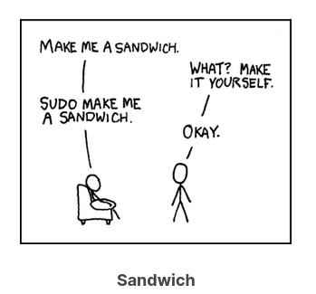

### Switching Between the GUI and the Command Line

The customizable nature of Linux allows you to drop the graphical interface (temporarily or permanently) or to start it up after the system has been running.

Most Linux distributions give an option during installation (or have more than one version of the install media) to choose between desktop (with a graphical desktop) and server (usually without one).

Linux production servers are usually installed without the GUI, and even if it is installed, usually do not launch it during system startup. Removing the graphical interface from a production server can be very helpful in maintaining a lean system, which can be easier to support and keep secure.

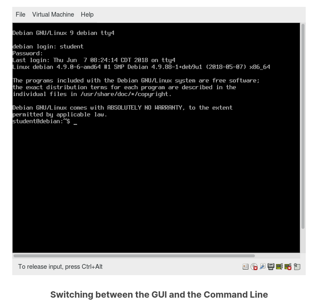

### Virtual Terminals

Virtual Terminals (VT) are console sessions that use the entire display and keyboard outside of a graphical environment. Such terminals are considered "virtual" because, although there can be multiple active terminals, only one terminal remains visible at a time. A VT is not quite the same as a command line terminal window; you can have many of those visible at once on a graphical desktop.

One virtual terminal (usually number one or seven) is reserved for the graphical environment, and text logins are enabled on the unused VTs. Ubuntu uses VT 7, but CentOS/RHEL and openSUSE use VT 1 for the graphical display.

An example of a situation where using VTs is helpful is when you run into problems with the graphical desktop. In this situation, you can switch to one of the text VTs and troubleshoot.

To switch between VTs, press CTRL-ALT-function key for the VT. For example, press CTRL-ALT-F6 for VT 6. Actually, you only have to press the ALT-F6 key combination if you are in a VT and want to switch to another VT.

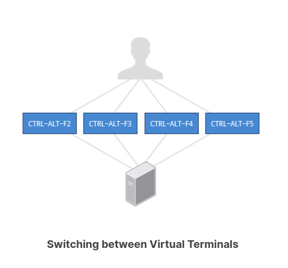

### Turning Off the Graphical Desktop

Linux distributions can start and stop the graphical desktop in various ways. The exact method differs from distribution and among distribution versions. For the newer systemd-based distributions, the display manager is run as a service, you can stop the GUI desktop with the systemctl utility and most distributions will also work with the telinit command, as in:

`$ sudo systemctl stop gdm (or sudo telinit 3)`

and restart it (after logging into the console) with:

`$ sudo systemctl start gdm (or sudo telinit 5)`

On Ubuntu versions before 18.04 LTS, substitute lightdm for gdm.

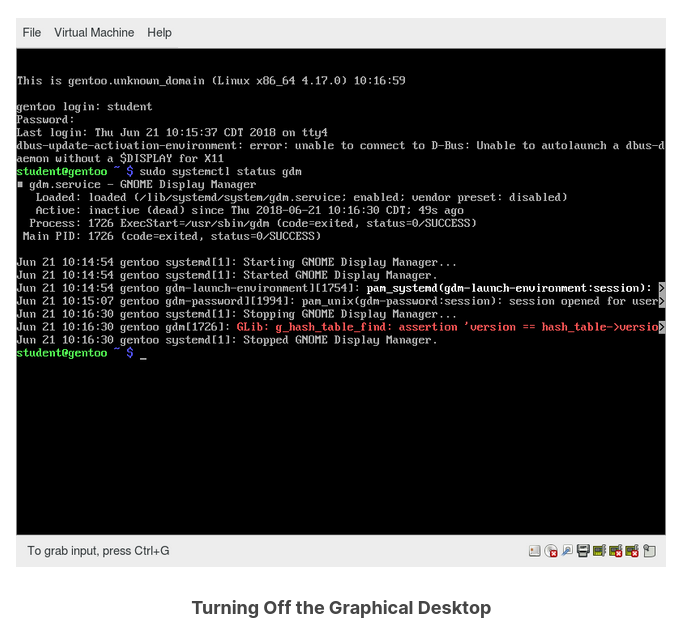

### Killing the Graphical User Interface

Methods of bringing down the GUI:

`student:/tmp> sudo systemctl stop gdm`
`student:/tmp> sudo systemctl stop lightdm`
`student:/tmp> sudo telinit 3`

Methods of bringing the GUI back up:

`student:/tmp> sudo systemctl start gdm`
`student:/tmp> sudo systemctl start lightdm`
`student:/tmp> sudo telinit 5`

### Basic Operations

In this section, we will discuss how to accomplish basic operations from the command line. These include how to log in and log out from the system, restart or shut down the system, locate applications, access directories, identify absolute and relative paths, and explore the filesystem.

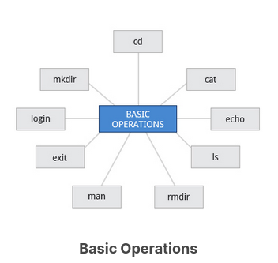

### Logging In and Out

An available text terminal will prompt for a username (with the string login:) and password. When typing your password, nothing is displayed on the terminal (not even a * to indicate that you typed in something), to prevent others from seeing your password. After you have logged into the system, you can perform basic operations.

Once your session is started (either by logging into a text terminal or via a graphical terminal program), you can also connect and log into remote systems by using Secure SHell (SSH). For example, by typing ssh student@remote-server.com, SSH would connect securely to the remote machine (remote-server.com) and give student a command line terminal window, using either a password (as with regular logins) or cryptographic key to sign in without providing a password to verify the identity.

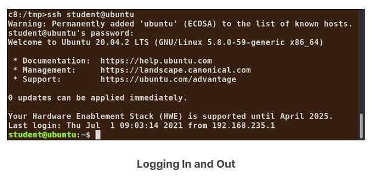

### Rebooting and Shutting Down

The preferred method to shut down or reboot the system is to use the shutdown command. This sends a warning message, and then prevents further users from logging in. The init process will then control shutting down or rebooting the system. It is important to always shut down properly; failure to do so can result in damage to the system and/or loss of data.

The halt and poweroff commands issue shutdown -h to halt the system; reboot issues shutdown -r and causes the machine to reboot instead of just shutting down. Both rebooting and shutting down from the command line requires superuser (root) access.

When administering a multi-user system, you have the option of notifying all users prior to shutdown, as in:

`$ sudo shutdown -h 10:00` "Shutting down for scheduled maintenance."

NOTE: On recent Wayland-based Linux distributions, broadcast messages do not appear on terminal emulation sessions running on the desktop; they appear only on the VT console displays.

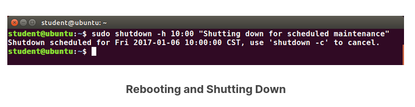

### Locating Applications

Depending on the specifics of your particular distribution's policy, programs and software packages can be installed in various directories. In general, executable programs and scripts should live in the /bin, /usr/bin, /sbin, /usr/sbin directories, or somewhere under /opt. They can also appear in /usr/local/bin and /usr/local/sbin, or in a directory in a user's account space, such as /home/student/bin.

One way to locate programs is to employ the which utility. For example, to find out exactly where the diff program resides on the filesystem:

`$ which diff`
/usr/bin/diff

If which does not find the program, whereis is a good alternative because it looks for packages in a broader range of system directories:

`$ whereis diff`
diff: /usr/bin/diff /usr/share/man/man1/diff.1.gz /usr/share/man/man1p/diff.1p.gz

as well as locating source and man files packaged with the program.

### Accessing Directories

When you first log into a system or open a terminal, the default directory should be your home directory. You can print the exact path of this by typing echo $HOME. Many Linux distributions actually open new graphical terminals in \$HOME/Desktop. The following commands are useful for directory navigation:

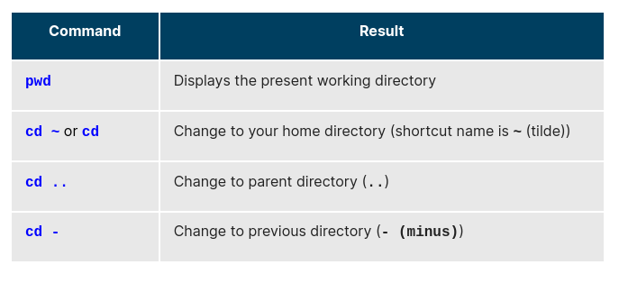

### Understanding Absolute and Relative Paths

There are two ways to identify paths:

- Absolute pathname
            An absolute pathname begins with the root directory and follows the tree, branch by branch, until it reaches the desired directory or file. Absolute paths always start with /.
- Relative pathname
            A relative pathname starts from the present working directory. Relative paths never start with /.

Multiple slashes (/) between directories and files are allowed, but all but one slash between elements in the pathname is ignored by the system. ////usr//bin is valid, but seen as /usr/bin by the system.

Most of the time, it is most convenient to use relative paths, which require less typing. Usually, you take advantage of the shortcuts provided by: . (present directory), .. (parent directory) and ~ (your home directory).

For example, suppose you are currently working in your home directory and wish to move to the /usr/bin directory. The following two ways will bring you to the same directory from your home directory:

- Absolute pathname method
            $ cd /usr/bin
- Relative pathname method
            $ cd ../../usr/bin

In this case, the absolute pathname method requires less typing.

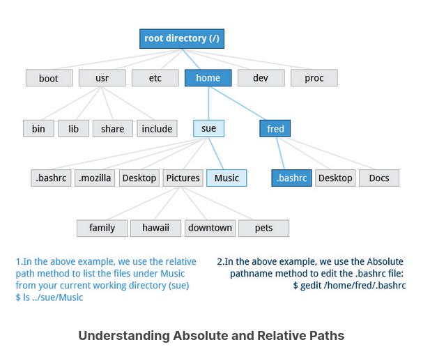

### Exploring the Filesystem

Traversing up and down the filesystem tree can get tedious. The tree command is a good way to get a bird’s-eye view of the filesystem tree. Use tree -d to view just the directories and to suppress listing file names.

The following commands can help in exploring the filesystem:

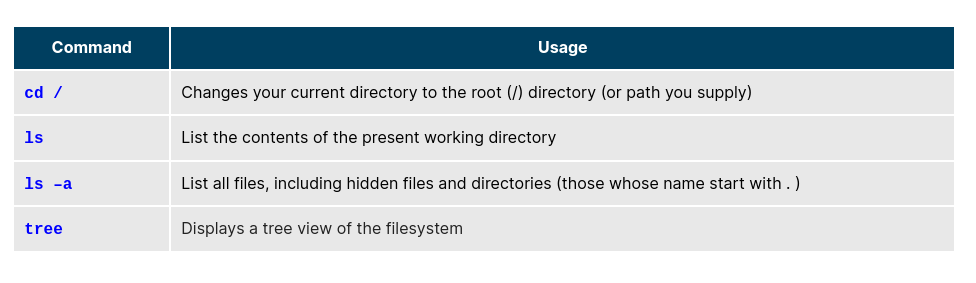

### Hard Links

he ln utility is used to create hard links and (with the -s option) soft links, also known as symbolic links or symlinks. These two kinds of links are very useful in UNIX-based operating systems.

Suppose that file1 already exists. A hard link, called file2, is created with the command:

`$ ln file1 file2`

Note that two files now appear to exist. However, a closer inspection of the file listing shows that this is not quite true.

`$ ls -li file1 file2`

The -i option to ls prints out in the first column the inode number, which is a unique quantity for each file object. This field is the same for both of these files; what is really going on here is that it is only one file, but it has more than one name associated with it, as is indicated by the 2 that appears in the ls output. Thus, there was already another object linked to file1 before the command was executed.

Hard links are very useful and they save space, but you have to be careful with their use, sometimes in subtle ways. For one thing, if you remove either file1 or file2 in the example, the inode object (and the remaining file name) will remain, which might be undesirable, as it may lead to subtle errors later if you recreate a file of that name.

If you edit one of the files, exactly what happens depends on your editor; most editors, including vi and gedit, will retain the link by default, but it is possible that modifying one of the names may break the link and result in the creation of two objects.

`touch file1`
`ln file1 file2`
`ls -li file?`

### Soft (Symbolic) Links

Soft (or Symbolic) links are created with the -s option, as in:

`$ ln -s file1 file3`
`$ ls -li file1 file3`

Notice file3 no longer appears to be a regular file, and it clearly points to file1 and has a different inode number.

Symbolic links take no extra space on the filesystem (unless their names are very long). They are extremely convenient, as they can easily be modified to point to different places. An easy way to create a shortcut from your home directory to long pathnames is to create a symbolic link.

Unlike hard links, soft links can point to objects even on different filesystems, partitions, and/or disks and other media, which may or may not be currently available or even exist. In the case where the link does not point to a currently available or existing object, you obtain a dangling link.

`ln -s file1 file3`
`ls -li file1 file3`

### Navigating the Directory History

The `cd` command remembers where you were last, and lets you get back there with `cd` -. For remembering more than just the last directory visited, use `pushd` to change the directory instead of `cd`; this pushes your starting directory onto a list. Using `popd` will then send you back to those directories, walking in reverse order (the most recent directory will be the first one retrieved with `popd`). The list of directories is displayed with the `dirs` command.

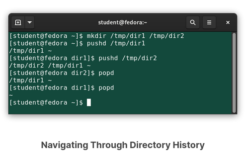

### Working with Files

Linux provides many commands that help you with viewing the contents of a file, creating a new file or an empty file, changing the timestamp of a file, and moving, removing and renaming a file or directory. These commands help you in managing your data and files and in ensuring that the correct data is available at the correct location.

### Viewing Files

You can use the following command line utilities to view files:

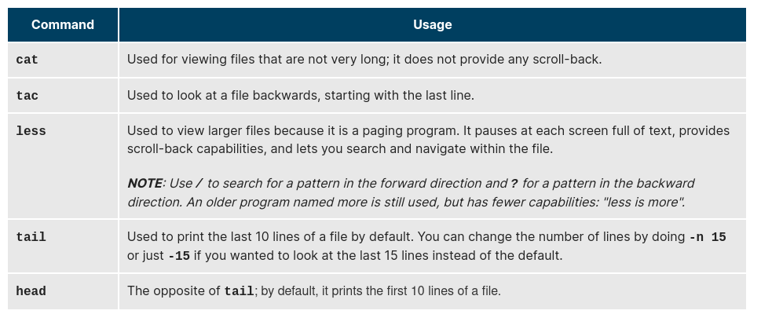

### touch

touch is often used to set or update the access, change, and modify times of files. By default, it resets a file's timestamp to match the current time.

However, you can also create an empty file using touch:

`$ touch <filename>`

This is normally done to create an empty file as a placeholder for a later purpose.

touch provides several useful options. For example, the -t option allows you to set the date and timestamp of the file to a specific value, as in:

`$ touch -t 12091600 myfile`

This sets the myfile file's timestamp to 4 p.m., December 9th (12 09 1600).

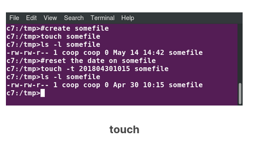

### mkdir and rmdir

mkdir is used to create a directory:

- `mkdir sampdir` 
            It creates a sample directory named sampdir under the current directory. 
- `mkdir /usr/sampdir` 
            It creates a sample directory called sampdir under /usr.

Removing a directory is done with rmdir. The directory must be empty or the command will fail. To remove a directory and all of its contents you have to do rm -rf.

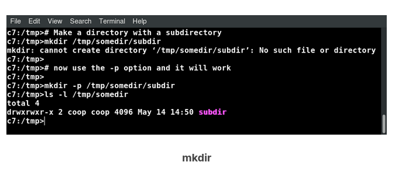

### Moving, Renaming or Removing a File

Note that mv does double duty, in that it can:

- Simply rename a file
- Move a file to another location, while possibly changing its name at the same time.

If you are not certain about removing files that match a pattern you supply, it is always good to run rm interactively (rm –i) to prompt before every removal.

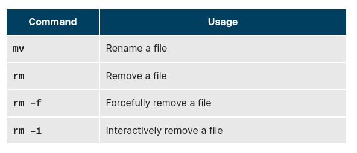

### Renaming or Removing a Directory

`rmdir` works only on empty directories; otherwise you get an error. 

While typing `rm –rf` is a fast and easy way to remove a whole filesystem tree recursively, it is extremely dangerous and should be used with the utmost care, especially when used by root (recall that recursive means drilling down through all sub-directories, all the way down a tree).

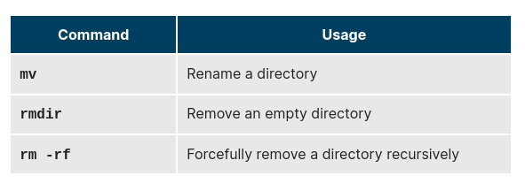

### Modifying the Command Line Prompt

The PS1 variable is the character string that is displayed as the prompt on the command line. Most distributions set PS1 to a known default value, which is suitable in most cases. However, users may want custom information to show on the command line. For example, some system administrators require the user and the host system name to show up on the command line as in:

`student@c8 $`

This could prove useful if you are working in multiple roles and want to be always reminded of who you are and what machine you are on. The prompt above could be implemented by setting the PS1 variable to: \u@\h \$.

For example:

`$ echo $PS1`
`\$`
`$ PS1="\u@\h \$ "`
`student@c8 $ echo $PS1`
`\u@\h \$`
`student@c8 $`

By convention, most systems are set up so that the root user has a pound sign (#) as their prompt.

### Standard File Streams

When commands are executed, by default there are three standard file streams (or descriptors) always open for use: standard input (standard in or stdin), standard output (standard out or stdout) and standard error (or stderr).

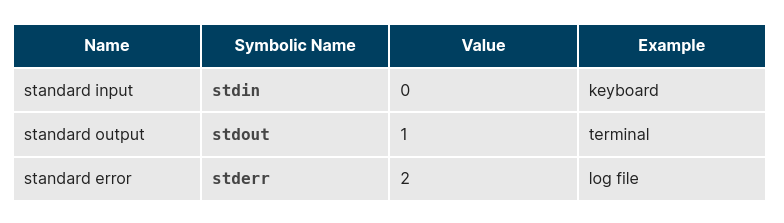

Usually, stdin is your keyboard, and stdout and stderr are printed on your terminal. stderr is often redirected to an error logging file, while stdin is supplied by directing input to come from a file or from the output of a previous command through a pipe. stdout is also often redirected into a file. Since stderr is where error messages are written, usually nothing will go there.

In Linux, all open files are represented internally by what are called file descriptors. Simply put, these are represented by numbers starting at zero. stdin is file descriptor 0, stdout is file descriptor 1, and stderr is file descriptor 2. Typically, if other files are opened in addition to these three, which are opened by default, they will start at file descriptor 3 and increase from there.

On the next page and in the chapters ahead, you will see examples which alter where a running command gets its input, where it writes its output, or where it prints diagnostic (error) messages.

### I/O Redirection

Through the command shell, we can redirect the three standard file streams so that we can get input from either a file or another command, instead of from our keyboard, and we can write output and errors to files or use them to provide input for subsequent commands.

For example, if we have a program called do_something that reads from stdin and writes to stdout and stderr, we can change its input source by using the less-than sign (<) followed by the name of the file to be consumed for input data:

`$ do_something < input-file`

If you want to send the output to a file, use the greater-than sign (>) as in:

`$ do_something > output-file`

Because stderr is not the same as stdout, error messages will still be seen on the terminal windows in the above example.

If you want to redirect stderr to a separate file, you use stderr’s file descriptor number (2), the greater-than sign (>), followed by the name of the file you want to hold everything the running command writes to stderr:

`$ do_something 2> error-file`

NOTE: By the same logic, do_something 1> output-file is the same as do_something > output-file.

A special shorthand notation can send anything written to file descriptor 2 (stderr) to the same place as file descriptor 1 (stdout): 2>&1.

`$ do_something > all-output-file 2>&1`

bash permits an easier syntax for the above:

`$ do_something >& all-output-file`

### Pipes

The UNIX/Linux philosophy is to have many simple and short programs (or commands) cooperate together to produce quite complex results, rather than have one complex program with many possible options and modes of operation. In order to accomplish this, extensive use of pipes is made. You can pipe the output of one command or program into another as its input.

In order to do this, we use the vertical-bar, pipe symbol (|), between commands as in:
 
`$ command1 | command2 | command3`

The above represents what we often call a pipeline, and allows Linux to combine the actions of several commands into one. This is extraordinarily efficient because command2 and command3 do not have to wait for the previous pipeline commands to complete before they can begin hacking at the data in their input streams; on multiple CPU or core systems, the available computing power is much better utilized and things get done quicker.

Furthermore, there is no need to save output in (temporary) files between the stages in the pipeline, which saves disk space and reduces reading and writing from disk, which is often the slowest bottleneck in getting something done.

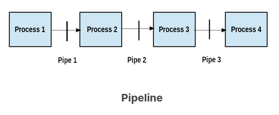

### Searching for Files

Being able to quickly find the files you are looking for will save you time and enhance productivity. You can search for files in both your home directory space, or in any other directory or location on the system.

The main tools for doing this are the locate and find utilities. We will also show how to use wildcards in bash, in order to specify any file which matches a given generalized request.

### locate

The locate utility program performs a search taking advantage of a previously constructed database of files and directories on your system, matching all entries that contain a specified character string. This can sometimes result in a very long list.

To get a shorter (and possibly more relevant) list, we can use the grep program as a filter. grep will print only the lines that contain one or more specified strings, as in: 

`$ locate zip | grep bin`

which will list all the files and directories with both zip and bin in their name. We will cover grep in much more detail later. Notice the use of | to pipe the two commands together.

locate utilizes a database created by a related utility, updatedb. Most Linux systems run this automatically once a day. However, you can update it at any time by just running updatedb from the command line as the root user.

### Wildcards and Matching File Names

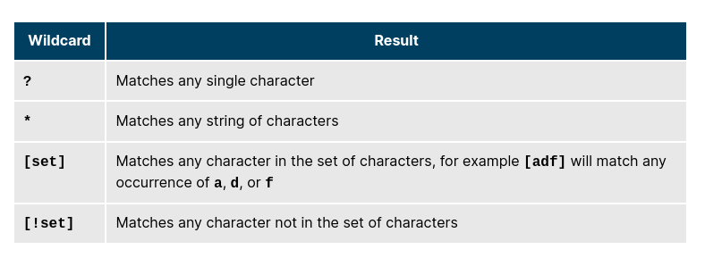

To search for files using the ? wildcard, replace each unknown character with ?. For example, if you know only the first two letters are 'ba' of a three-letter filename with an extension of .out, type ls ba?.out.

To search for files using the * wildcard, replace the unknown string with *. For example, if you remember only that the extension was .out, type ls *.out.

### The find Program

find is an extremely useful and often-used utility program in the daily life of a Linux system administrator. It recurses down the filesystem tree from any particular directory (or set of directories) and locates files that match specified conditions. The default pathname is always the present working directory.

For example, administrators sometimes scan for potentially large core files (which contain diagnostic information after a program fails) that are more than several weeks old in order to remove them.

It is also common to remove files in inessential or outdated files in /tmp (and other volatile directories, such as those containing cached files) that have not been accessed recently. Many Linux distributions use shell scripts that run periodically (through cron usually) to perform such house cleaning.

### Using find

When no arguments are given, find lists all files in the current directory and all of its subdirectories. Commonly used options to shorten the list include -name (only list files with a certain pattern in their name), -iname (also ignore the case of file names), and -type (which will restrict the results to files of a certain specified type, such as d for directory, l for symbolic link, or f for a regular file, etc.). 

Searching for files and directories named gcc:

`$ find /usr -name gcc`

Searching only for directories named gcc:

`$ find /usr -type d -name gcc`

Searching only for regular files named gcc:

`$ find /usr -type f -name gcc`

### Using Advanced find Options

Another good use of find is being able to run commands on the files that match your search criteria. The -exec option is used for this purpose.

To find and remove all files that end with .swp:

`$ find -name "*.swp" -exec rm {} ’;’`

The {} (squiggly brackets) is a placeholder that will be filled with all the file names that result from the find expression, and the preceding command will be run on each one individually.

Please note that you have to end the command with either ‘;’ (including the single-quotes) or "\;". Both forms are fine.

One can also use the -ok option, which behaves the same as -exec, except that find will prompt you for permission before executing the command. This makes it a good way to test your results before blindly executing any potentially dangerous commands.

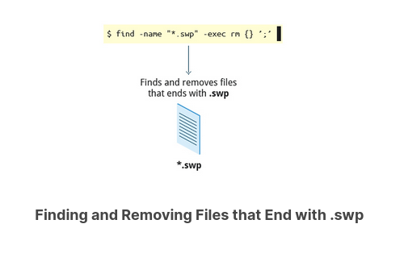

### Finding Files Based on Time and Size

It is sometimes the case that you wish to find files according to attributes, such as when they were created, last used, etc., or based on their size. It is easy to perform such searches.

To find files based on time:

`$ find / -ctime 3`

Here, -ctime is when the inode metadata (i.e. file ownership, permissions, etc.) last changed; it is often, but not necessarily, when the file was first created. You can also search for accessed/last read (-atime) or modified/last written (-mtime) times. The number is the number of days and can be expressed as either a number (n) that means exactly that value, +n, which means greater than that number, or -n, which means less than that number. There are similar options for times in minutes (as in -cmin, -amin, and -mmin).

To find files based on sizes:

`$ find / -size 0`

Note the size here is in 512-byte blocks, by default; you can also specify bytes (c), kilobytes (k), megabytes (M), gigabytes (G), etc. As with the time numbers above, file sizes can also be exact numbers (n), +n or -n. For details, consult the man page for find.

For example, to find files greater than 10 MB in size and running a command on those files:

`$ find / -size +10M -exec command {} ’;’`

### Finding Directories and Creating Symbolic Links

Find the init.d directory, starting from /, and then create a symbolic link from within your home directory to this directory.

Note that this SysVinit directory is no longer used much in systemd-based systems, but is kept for backwards compatibility reasons.

`student:/tmp> find / -type d -name init.d`
`student:/tmp> cd ~`
`student:/home/student> ln -s /etc/init.d . ` 

Note you will get a lot of noise about trying to look at files and directories normal users are not allowed to examine. If you preface the find command with sudo these will not occur.

### Package Management Systems on Linux

The core parts of a Linux distribution and most of its add-on software are installed via the Package Management System. Each package contains the files and other instructions needed to make one software component work well and cooperate with the other components that comprise the entire system. Packages can depend on each other. For example, a package for a web-based application written in PHP can depend on the PHP package.

There are two broad families of package managers: those based on Debian and those which use RPM as their low-level package manager. The two systems are incompatible, but broadly speaking, provide the same features and satisfy the same needs. There are some other systems used by more specialized Linux distributions.

In this section, you will learn how to install, remove, or search for packages from the command line using these two package management systems.

### Package Managers: Two Levels

Both package management systems operate on two distinct levels: a low-level tool (such as dpkg or rpm) takes care of the details of unpacking individual packages, running scripts, getting the software installed correctly, while a high-level tool (such as apt-get, dnf, yum, or zypper) works with groups of packages, downloads packages from the vendor, and figures out dependencies.

Most of the time users need to work only with the high-level tool, which will take care of calling the low-level tool as needed. Dependency resolution is a particularly important feature of the high-level tool, as it handles the details of finding and installing each dependency for you. Be careful, however, as installing a single package could result in many dozens or even hundreds of dependent packages being installed.

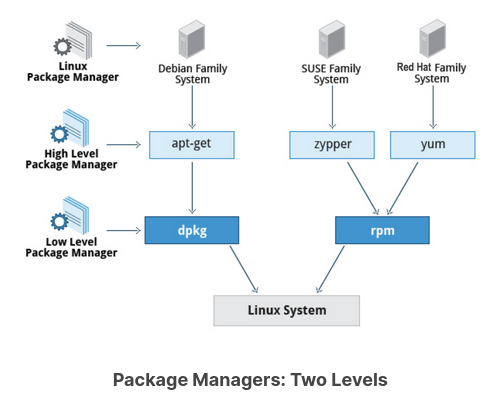

### Working With Different Package Management Systems

The Advanced Packaging Tool (apt) is the underlying package management system that manages software on Debian-based systems. While it forms the backend for graphical package managers, such as the Ubuntu Software Center and synaptic, its native user interface is at the command line, with programs that include apt (or apt-get) and apt-cache.

dnf is the open source command-line package-management utility for the RPM-compatible Linux systems that belongs to the Red Hat family. dnf has both command line and graphical user interfaces. Fedora and RHEL 8 replaced the older yum utility with dnf, thereby eliminating a lot of historical baggage, as well as introducing many nice new capabilities. dnf is pretty much backwards-compatible with yum for day-to-day commands.

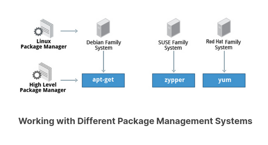

zypper is the package management system for the SUSE/openSUSE family and is also based on RPM. zypper also allows you to manage repositories from the command line. zypper is fairly straightforward to use and resembles dnf/yum quite closely.

To learn the basic packaging commands, take a look at these basic packaging commands:

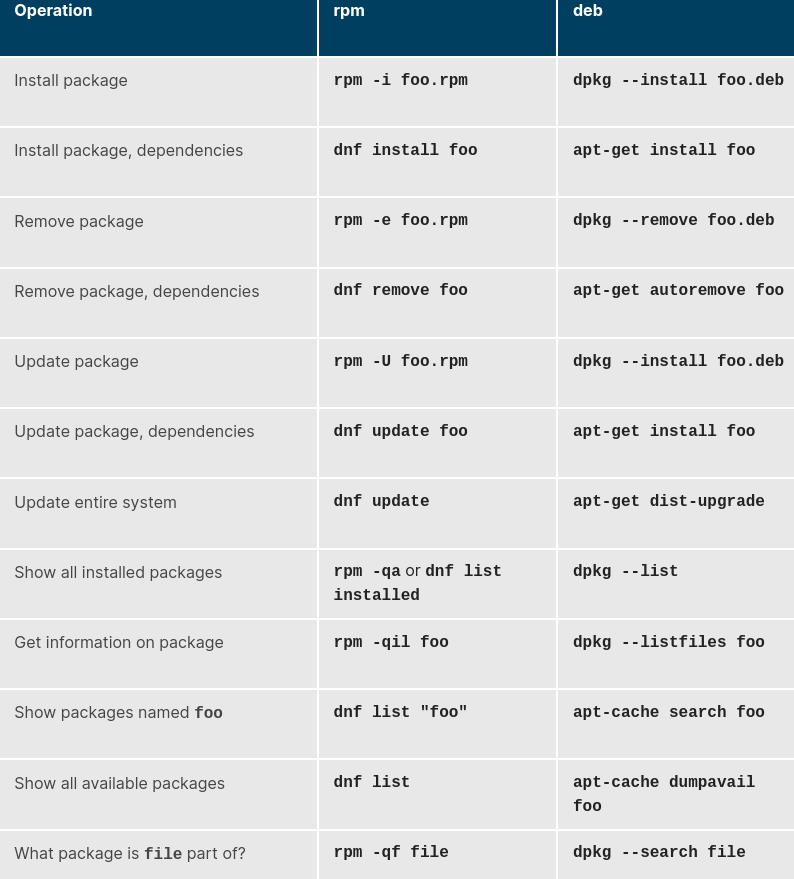

### Installing and Removing Software Packages

Using the upper-level package management system appropriate for your Linux distribution, do the following:

1. Install the dump package on your system.
2. Remove the dump package from your system.

NOTE: If dump is already installed (you will be told so when you try to install), then do things in opposite order, i.e. remove and then install.

`student:/tmp> apt-get install dump`
`student:/tmp> apt-get remove dump  `    

or

`student:/tmp> dnf install dump`
`student:/tmp> dnf remove dump  `    

or

`student:/tmp> yum install dump`
`student:/tmp> yum remove dump   `   

or

`student:/tmp> zypper install dump`
`student:/tmp> zypper remove dump`

### Chapter Summary

ou have completed Chapter 7. Let’s summarize the key concepts we covered:

- Virtual terminals (VT) in Linux are consoles, or command line terminals that use the connected monitor and keyboard.
- Different Linux distributions start and stop the graphical desktop in different ways.
- A terminal emulator program on the graphical desktop works by emulating a terminal within a window on the desktop.
- The Linux system allows you to either log in via text terminal or remotely via the console.
- When typing your password, nothing is printed to the terminal, not even a generic symbol to indicate that you typed.
- The preferred method to shut down or reboot the system is to use the shutdown command.
- There are two types of pathnames: absolute and relative.
- An absolute pathname begins with the root directory and follows the tree, branch by branch, until it reaches the desired directory or file.
- A relative pathname starts from the present working directory.
- Using hard and soft (symbolic) links is extremely useful in Linux.
- cd remembers where you were last, and lets you get back there with cd -.
- locate performs a database search to find all file names that match a given pattern.
- find locates files recursively from a given directory or set of directories.
- find is able to run commands on the files that it lists, when used with the -exec option.
- touch is used to set the access, change, and edit times of files, as well as to create empty files.
- The Advanced Packaging Tool (apt) package management system is used to manage installed software on Debian-based systems.
- You can use the dnf command-line package management utility for the RPM-based Red Hat Family Linux distributions.
- The zypper package management system is based on RPM and used for openSUSE.

### Linux Documentation Sources

Whether you are an inexperienced user or a veteran, you will not always know (or remember) the proper use of various Linux programs and utilities: what is the command to type, what options does it take, etc. You will need to consult help documentation regularly. Because Linux-based systems draw from a large variety of sources, there are numerous reservoirs of documentation and ways of getting help. Distributors consolidate this material and present it in a comprehensive and easy-to-use manner.

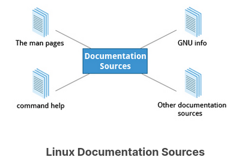

Important Linux documentation sources include:

- The man pages (short for manual pages)
- GNU Info
- The help command and --help option
- Other documentation sources, e.g. Gentoo Handbook or Ubuntu Documentation.

### The man pages

The man pages are the most often-used source of Linux documentation. They provide in-depth documentation about many programs and utilities, as well as other topics, including configuration files, and programming APIs for system calls, library routines, and the kernel. They are present on all Linux distributions and are always at your fingertips.

The man pages infrastructure was first introduced in the early UNIX versions, at the beginning of the 1970s. The name man is just an abbreviation for manual.

Typing man with a topic name as an argument retrieves the information stored in the topic's man pages.

man pages are often converted to other formats, such as PDF documents and web pages. To learn more, take a look at Linux man pages online. Many web pages have a graphical interface for help items, which may include man pages.

Other sources of documentation include published books and many Internet sites.

#### man

The man program searches, formats, and displays the information contained in the man page system. Because many topics have copious amounts of relevant information, output is piped through a pager program (such as less) to be viewed one page at a time. At the same time, the information is formatted for a good visual display.

A given topic may have multiple pages associated with it and there is a default order determining which one is displayed when no options or section number is specified. To list all pages on the topic, use the -f option. To list all pages that discuss a specific topic (even if the specified subject is not present in the name), use the –k option.

- `man –f` generates the same result as typing `whatis`.
- `man –k` generates the same result as typing `apropos`.

The default order is specified in /etc/man_db.conf and is roughly (but not exactly) in ascending numerical order by section.

### Manual Chapters

The man pages are divided into chapters numbered 1 through 9. In some cases, a letter is appended to the chapter number to identify a specific topic. For example, many pages describing part of the X Window API are in chapter 3X.

The chapter number can be used to force man to display the page from a particular chapter. It is common to have multiple pages across multiple chapters with the same name, especially for names of library functions or system calls.

With the -a parameter, man will display all pages with the given name in all chapters, one after the other, as in:

`$ man -a socket`

### Working with man

Now, try to do the following:

1. Finding man pages
    From the command line, bring up the man page for man itself. Scroll down to the EXAMPLES section.
2. Finding man pages by topic
    What man pages are available that document file compression?
3. Finding man pages by section
    From the command line, bring up the man page for the printf library function. In which manual page section are library functions found?
---

1. `student:/tmp> man man`
    Use the Page Down key or search in less with the '/' key for the EXAMPLES section.
2. `student:/tmp> man -k compress`
    or
    `student:/tmp> apropos compress`
    will bring up a long list of programs and references, including gzip, bzip2 and xz, and a number of file utilities that work with compressed files, such as zless, zgrep, bzcat, and xzdiff.
3. `student:/tmp> man 3 printf`
    (man printf will bring up the command-line utility (section 1) of the same name.)
    
### The GNU Info System

The next source of Linux documentation is the GNU Info System.

This is the GNU project's standard documentation format, which it prefers as an alternative to man. The Info System is basically free-form, and supports linked subsections.

Functionally, info resembles man in many ways. However, topics are connected using links (even though its design predates the World Wide Web). Information can be viewed through either a command line interface, a graphical help utility, printed or viewed online.

### Using info from the Command Line

Typing info with no arguments in a terminal window displays an index of available topics. You can browse through the topic list using the regular movement keys: arrows, Page Up, and Page Down.

You can view help for a particular topic by typing info <topic name>. The  system then searches for the topic in all available info files.

Some useful keys are: q to quit, h for help, and Enter to select a menu item.

### info Page Structure

The topic which you view in an info page is called a node. The table lists the basic keystrokes for moving between nodes.

Nodes are essentially sections and subsections in the documentation. You can move between nodes or view each node sequentially. Each node may contain menus and linked subtopics, or items.

Items function like browser links and are identified by an asterisk (*) at the beginning of the item name. Named items (outside a menu) are identified with double-colons (::) at the end of the item name. Items can refer to other nodes within the file or to other files. 

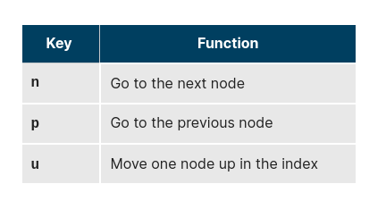

### Working with info

From the command line, bring up the info page for cpio. Bring up the tutorial.

`student:/tmp> info cpio`

Move the cursor down to the Tutorial node, and press Enter.

### The --help Option

Another important source of Linux documentation is use of the --help option.

Most commands have an available short description which can be viewed using the --help or the -h option along with the command or application. For example, to learn more about the man command, you can type: 

`$ man --help`

The --help option is useful as a quick reference and it displays information faster than the man or info pages.

### The help Command

When run within a bash command shell, some popular commands (such as echo and cd) actually run especially built-in bash versions of the commands rather than the usual binaries found on the file system, say under /bin or /usr/bin. It is more efficient to do so as execution is faster because fewer resources are used (we will discuss command shells later). One should note that there can be some (usually small) differences in the two versions of the command.

To view a synopsis of these built-in commands, you can simply type help as shown in the screenshot.

For these built-in commands, help performs the same basic function as the -h and --help arguments perform for standalone programs.

### Working with Command Line help

List the available options for the mkdir command, in more than one way.

`student:/tmp> mkdir --help `

or

`student:/tmp>$ man mkdir`

### Other Documentation Sources

In addition to the man pages, the GNU Info System, and the help command, there are other sources of Linux documentation, some examples of which include:

- Desktop help system
- Package documentation
- Online resources.

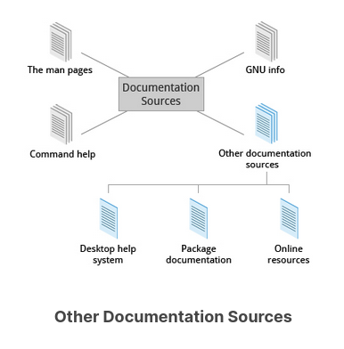

### Graphical Help Systems

ll Linux desktop systems have a graphical help application. This application is usually displayed as a question-mark icon or an image of a ship’s life-preserver, and can also always be found within the menu system. These programs usually contain custom help for the desktop itself and some of its applications, and will sometimes also include graphically-rendered info and man pages.

If you do not want to spend time hunting for the right icon or menu item to launch the help application, you can also start the graphical help system from a terminal window or command prompt by using one of the following utility programs:

- GNOME: `gnome-help` or `yelp`
- KDE: `khelpcenter`

### Package Documentation

Linux documentation is also available as part of the package management system. Usually, this documentation is directly pulled from the upstream source code, but it can also contain information about how the distribution packaged and set up the software.

Such information is placed under the /usr/share/doc directory, grouped in subdirectories named after each package, perhaps including the version number in the name.

### Online Resources

There are many places to access online Linux documentation, and a little bit of searching will get you buried in it.

The following book has been well-reviewed by other users of this course. It is a free, downloadable command line compendium under a Creative Commons license: "The Linux Command Line" by William Shotts.

You can also find very helpful documentation for each distribution. Each distribution has its own user-generated forums and wiki sections. Here are just a few links to such sources:

            Ubuntu Documentation
            CentoS Documentation
            openSUSE Documentation
            Gentoo Documentation
            Fedora Documentation.

Moreover, you can use online search sites to locate helpful resources from all over the Internet, including blog posts, forum and mailing list posts, news articles, and so on.

### Working with Graphical Help Systems

Find the graphical help system on your desktop and try to locate within it the man pages for printf. This may be difficult, so do not waste too much time before looking at the suggestions below. 

If you have been unable to find the man pages this way, we cannot give a unique solution to this. It varies from one Linux distribution to another, and one version to the next, but you should be able to hunt and find out where this is located and get familiar with the interface.

In earlier Linux distributions this was a rather easy task. Those days are gone for some desktops today.

If you are having trouble finding this on recent GNOME desktops, you are not alone. For some reason, clicking on Documentation > Help only brings up documentation about GNOME itself, using the yelp browser.

However, if at the command line you type something like:

`student:/tmp> yelp man:cat`

it will indeed bring up the man page for cat. However, you cannot type something like man:ls in the location bar and have it work, unless you hit CTRL-l first! It is not exactly clear whether this is a bug or a feature, but a bug seems more likely. Once you are in the page, clicking on links to get other man pages works just fine.

The same mechanism works to get info pages as well, as in:

`student:/tmp> yelp info:cpio`

### Chapter Summary

You have completed Chapter 8. Let’s summarize the key concepts covered:

- The main sources of Linux documentation are the man pages, GNU info, the help options and command, and a rich variety of online documentation sources. 
- The man utility searches, formats, and displays man pages.

- The man pages provide in-depth documentation about programs and other topics about the system, including configuration files, system calls, library routines, and the kernel.
- The GNU Info System was created by the GNU project as its standard documentation. It is robust and is accessible via command line, web, and graphical tools using info.
- Short descriptions for commands are usually displayed with the -h or --help argument.
- You can type help at the command line to display a synopsis of built-in commands.
- There are many other help resources both on your system and on the Internet.

### What Is a Process?

A process is simply an instance of one or more related tasks (threads) executing on your computer. It is not the same as a program or a command. A single command may actually start several processes simultaneously. Some processes are independent of each other and others are related. A failure of one process may or may not affect the others running on the system.

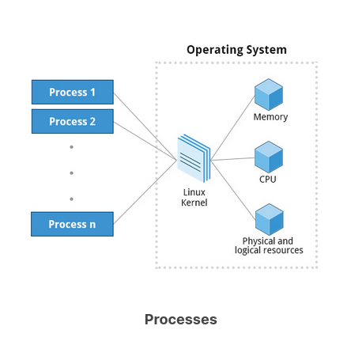

Processes use many system resources, such as memory, CPU (central processing unit) cycles, and peripheral devices, such as network cards, hard drives, printers and displays. The operating system (especially the kernel) is responsible for allocating a proper share of these resources to each process and ensuring overall optimized system utilization.

### Process Types

A terminal window (one kind of command shell) is a process that runs as long as needed. It allows users to execute programs and access resources in an interactive environment. You can also run programs in the background, which means they become detached from the shell.

Processes can be of different types according to the task being performed. Here are some different process types, along with their descriptions and examples:

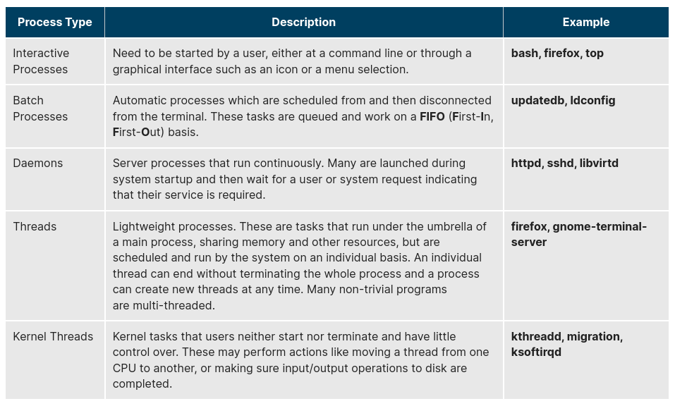

### Process Scheduling and States

A critical kernel function called the scheduler constantly shifts processes on and off the CPU, sharing time according to relative priority, how much time is needed and how much has already been granted to a task.

When a process is in a so-called running state, it means it is either currently executing instructions on a CPU, or is waiting to be granted a share of time (a time slice) so it can execute. All processes in this state reside on what is called a run queue and on a computer with multiple CPUs, or cores, there is a run queue on each.

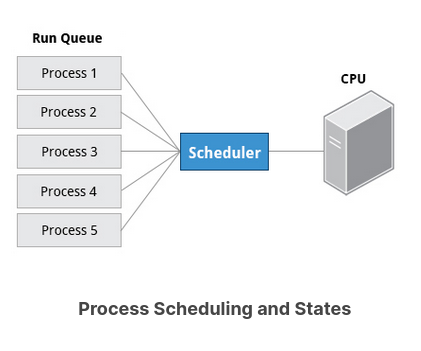

However, sometimes processes go into what is called a sleep state, generally when they are waiting for something to happen before they can resume, perhaps for the user to type something. In this condition, a process is said to be sitting in a wait queue.

There are some other less frequent process states, especially when a process is terminating. Sometimes, a child process completes, but its parent process has not asked about its state. Amusingly, such a process is said to be in a zombie state; it is not really alive, but still shows up in the system's list of processes.

### Process and Thread IDs

At any given time, there are always multiple processes being executed. The operating system keeps track of them by assigning each a unique process ID (PID) number. The PID is used to track process state, CPU usage, memory use, precisely where resources are located in memory, and other characteristics.

New PIDs are usually assigned in ascending order as processes are born. Thus, PID 1 denotes the init process (initialization process), and succeeding processes are gradually assigned higher numbers.

The table explains the PID types and their descriptions:

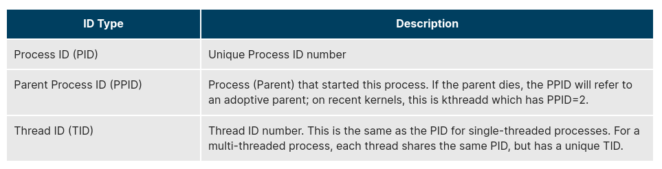

### Terminating a Process

At some point, one of your applications may stop working properly. How do you eliminate it?

To terminate a process, you can type kill -SIGKILL \<pid> or kill -9 \<pid>.

Note, however, you can only kill your own processes; those belonging to another user are off limits, unless you are root.

### User and Group IDs

Many users can access a system simultaneously, and each user can run multiple processes. The operating system identifies the user who starts the process by the Real User ID (RUID) assigned to the user.

The user who determines the access rights for the users is identified by the Effective UID (EUID). The EUID may or may not be the same as the RUID.

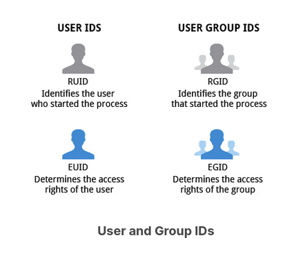

Users can be categorized into various groups. Each group is identified by the Real Group ID (RGID). The access rights of the group are determined by the Effective Group ID (EGID). Each user can be a member of one or more groups.

Most of the time we ignore these details and just talk about the User ID (UID) and Group ID (GID).

### More About Priorities

At any given time, many processes are running (i.e. in the run queue) on the system. However, a CPU can actually accommodate only one task at a time, just like a car can have only one driver at a time. Some processes are more important than others, so Linux allows you to set and manipulate process priority. Higher priority processes get preferential access to the CPU.

The priority for a process can be set by specifying a nice value, or niceness, for the process. The lower the nice value, the higher the priority. Low values are assigned to important processes, while high values are assigned to processes that can wait longer. A process with a high nice value simply allows other processes to be executed first. In Linux, a nice value of -20 represents the highest priority and +19 represents the lowest. While this may sound backwards, this convention (the nicer the process, the lower the priority) goes back to the earliest days of UNIX.

You can also assign a so-called real-time priority to time-sensitive tasks, such as controlling machines through a computer or collecting incoming data. This is just a very high priority and is not to be confused with what is called hard real-time which is conceptually different, and has more to do with making sure a job gets completed within a very well-defined time window.

### Load Averages

The load average is the average of the load number for a given period of time. It takes into account processes that are:

- Actively running on a CPU.
- Considered runnable, but waiting for a CPU to become available.
- Sleeping: i.e. waiting for some kind of resource (typically, I/O) to become available.

NOTE: Linux differs from other UNIX-like operating systems in that it includes the sleeping processes. Furthermore, it only includes so-called uninterruptible sleepers, those which cannot be awakened easily.

The load average can be viewed by running w, top or uptime. We will explain the numbers on the next page.

### Interpreting Load Averages

The load average is displayed using three numbers (0.45, 0.17, and 0.12) in the below screenshot. Assuming our system is a single-CPU system, the three load average numbers are interpreted as follows:

- 0.45: For the last minute the system has been 45% utilized on average.
- 0.17: For the last 5 minutes utilization has been 17%.
- 0.12: For the last 15 minutes utilization has been 12%.

If we saw a value of 1.00 in the second position, that would imply that the single-CPU system was 100% utilized, on average, over the past 5 minutes; this is good if we want to fully use a system. A value over 1.00 for a single-CPU system implies that the system was over-utilized: there were more processes needing CPU than CPU was available.

If we had more than one CPU, say a quad-CPU system, we would divide the load average numbers by the number of CPUs. In this case, for example, seeing a 1 minute load average of 4.00 implies that the system as a whole was 100% (4.00/4) utilized during the last minute.

Short-term increases are usually not a problem. A high peak you see is likely a burst of activity, not a new level. For example, at start up, many processes start and then activity settles down. If a high peak is seen in the 5 and 15 minute load averages, it may be cause for concern.

### Background and Foreground Processes

Linux supports background and foreground job processing. A job in this context is just a command launched from a terminal window. Foreground jobs run directly from the shell, and when one foreground job is running, other jobs need to wait for shell access (at least in that terminal window if using the GUI) until it is completed. This is fine when jobs complete quickly. But this can have an adverse effect if the current job is going to take a long time (even several hours) to complete.

In such cases, you can run the job in the background and free the shell for other tasks. The background job will be executed at lower priority, which, in turn, will allow smooth execution of the interactive tasks, and you can type other commands in the terminal window while the background job is running. By default, all jobs are executed in the foreground. You can put a job in the background by suffixing & to the command, for example: updatedb &.

You can either use CTRL-Z to suspend a foreground job or CTRL-C to terminate a foreground job and can always use the bg and fg commands to run a process in the background and foreground, respectively.

### Managing Jobs

The jobs utility displays all jobs running in background. The display shows the job ID, state, and command name, as shown here.

jobs -l provides the same information as jobs, and adds the PID of the background jobs.

The background jobs are connected to the terminal window, so, if you log off, the jobs utility will not show the ones started from that window.

### Getting Uptime and Load Averages

Ascertain how long your system has been up. 

Display its load averages.

A very simple method is just to use the uptime utility:

`student:/tmp> uptime`

A second method is to look at the first line of output from top (to be discussed in detail shortly):

`student:/tmp> top | head`

A third method is to use w:

`student:/tmp> w`

### Background and Foreground Jobs

We are going to launch a graphical program from a terminal window, so that one can no longer type in the window. gedit is an easy choice, but you can substitute any other program that does this.

The solution file contains a step-by-step procedure for putting jobs in background, bringing them back to foreground, etc. Please repeat the steps, substituting the program you are using if it is not gedit.

We are going to launch a graphical program from a terminal window so that one can no longer type in the window. gedit is an easy choice, but you can substitute any other program that does this.

1. Open gedit on a new file as in:

    `$ gedit somefile `    

2. While you can still type in the terminal window, the shell will not pay attention to what you input.
    While your pointer is over the terminal window, hit CTRL-Z.
    `^Z`
    You can no longer type in the gedit window.
3. With jobs -l, see what processes have been launched from this terminal window:

    `$ jobs -l`
4. Now put the most recent job (gedit somefile) in the background:

    `$ bg`
5. Put the process in foreground again:

    `$ fg`
    Note you once again input to the terminal window. It has no effect.
6. To clean up, suspend the process again and then use kill to terminate it:

    `^Z`
    `$ jobs -l`
    `$ kill -9 19827`
    `$ jobs -l`

### The ps Command (System V Style)

ps provides information about currently running processes keyed by PID. If you want a repetitive update of this status, you can use top or other commonly installed variants (such as htop or atop) from the command line, or invoke your distribution's graphical system monitor application.

ps has many options for specifying exactly which tasks to examine, what information to display about them, and precisely what output format should be used.

Without options, ps will display all processes running under the current shell. You can use the -u option to display information of processes for a specified username. The command ps -ef displays all the processes in the system in full detail. The command ps -eLf goes one step further and displays one line of information for every thread (remember, a process can contain multiple threads).

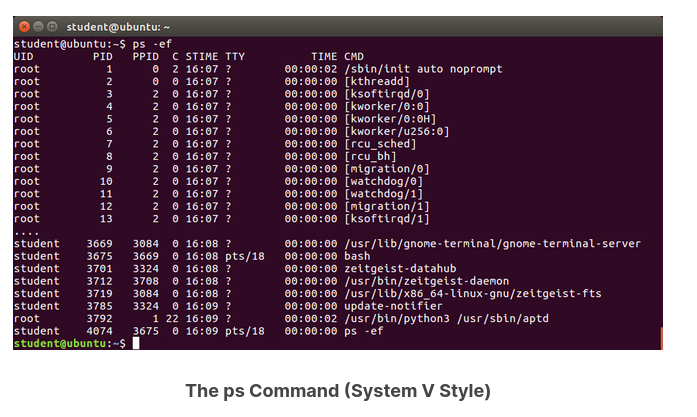

### The ps Command (BSD Style)

ps has another style of option specification, which stems from the BSD variety of UNIX, where options are specified without preceding dashes. For example, the command ps aux displays all processes of all users. The command ps axo allows you to specify which attributes you want to view.

The screenshot shows a sample output of ps with the aux and axo qualifiers.

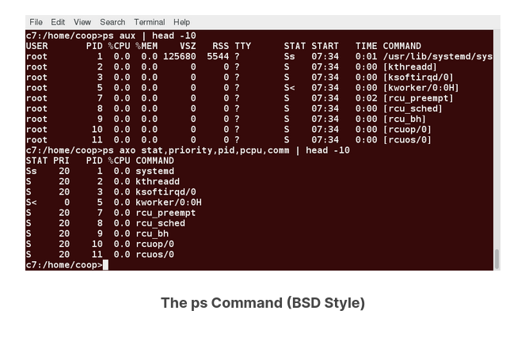

### The Process Tree

pstree displays the processes running on the system in the form of a tree diagram showing the relationship between a process and its parent process and any other processes that it created. Repeated entries of a process are not displayed, and threads are displayed in curly braces.

### top

While a static view of what the system is doing is useful, monitoring the system performance live over time is also valuable. One option would be to run ps at regular intervals, say, every few seconds. A better alternative is to use top to get constant real-time updates (every two seconds by default), until you exit by typing q.top clearly highlights which processes are consuming the most CPU cycles and memory (using appropriate commands from within top).

### First Line of the top Output

The first line of the top output displays a quick summary of what is happening in the system, including:

1. How long the system has been up
2. How many users are logged on
3. What is the load average

The load average determines how busy the system is. A load average of 1.00 per CPU indicates a fully subscribed, but not overloaded, system. If the load average goes above this value, it indicates that processes are competing for CPU time. If the load average is very high, it might indicate that the system is having a problem, such as a runaway process (a process in a non-responding state).

### Second Line of the top Output

The second line of the top output displays the total number of processes, the number of running, sleeping, stopped, and zombie processes. Comparing the number of running processes with the load average helps determine if the system has reached its capacity or perhaps a particular user is running too many processes. The stopped processes should be examined to see if everything is running correctly.

### Third Line of the top Output

The third line of the top output indicates how the CPU time is being divided between the users (us) and the kernel (sy) by displaying the percentage of CPU time used for each.

The percentage of user jobs running at a lower priority (niceness - ni) is then listed. Idle mode (id) should be low if the load average is high, and vice versa. The percentage of jobs waiting (wa) for I/O is listed. Interrupts include the percentage of hardware (hi) vs. software interrupts (si). Steal time (st) is generally used with virtual machines, which has some of its idle CPU time taken for other uses.

### Fourth and Fifth Lines of the top Output

The fourth and fifth lines of the top output indicate memory usage, which is divided in two categories:

- Physical memory (RAM) – displayed on line 4.
- Swap space – displayed on line 5.

Both categories display total memory, used memory, and free space.

You need to monitor memory usage very carefully to ensure good system performance. Once the physical memory is exhausted, the system starts using swap space (temporary storage space on the hard drive) as an extended memory pool, and since accessing disk is much slower than accessing memory, this will negatively affect system performance.

If the system starts using swap often, you can add more swap space. However, adding more physical memory should also be considered.

### Process List of the top Output

Each line in the process list of the top output displays information about a process. By default, processes are ordered by highest CPU usage. The following information about each process is displayed:

- Process Identification Number (PID)
- Process owner (USER)
- Priority (PR) and nice values (NI)
- Virtual (VIRT), physical (RES), and shared memory (SHR)
- Status (S)
- Percentage of CPU (%CPU) and memory (%MEM) used
- Execution time (TIME+)
- Command (COMMAND).

### Interactive Keys with top

Besides reporting information, top can be utilized interactively for monitoring and controlling processes. While top is running in a terminal window, you can enter single-letter commands to change its behavior. For example, you can view the top-ranked processes based on CPU or memory usage. If needed, you can alter the priorities of running processes or you can stop/kill a process.

The table lists what happens when pressing various keys when running top:

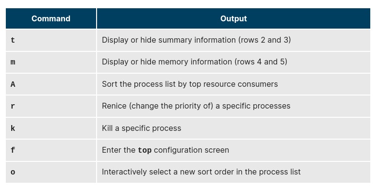

### Scheduling Future Processes Using at

Suppose you need to perform a task on a specific day sometime in the future. However, you know you will be away from the machine on that day. How will you perform the task? You can use the at utility program to execute any non-interactive command at a specified time, as illustrated in the screenshot below:

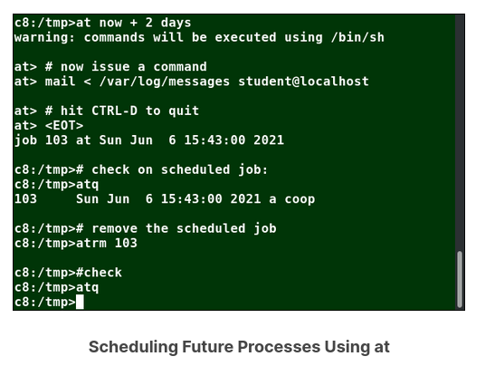

### cron

cron is a time-based scheduling utility program. It can launch routine background jobs at specific times and/or days on an on-going basis. cron is driven by a configuration file called /etc/crontab (cron table), which contains the various shell commands that need to be run at the properly scheduled times. There are both system-wide crontab files and individual user-based ones. Each line of a crontab file represents a job, and is composed of a so-called CRON expression, followed by a shell command to execute.

Typing crontab -e will open the crontab editor to edit existing jobs or to create new jobs. Each line of the crontab file will contain 6 fields:

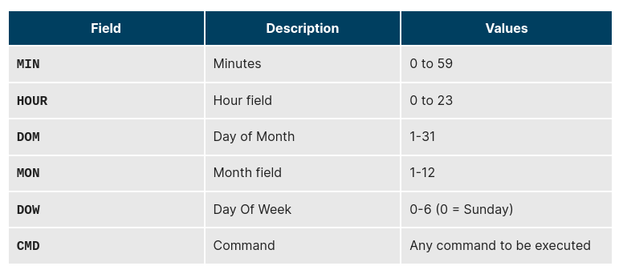

Examples:

- The entry * * * * * /usr/local/bin/execute/this/script.sh will schedule a job to execute script.sh every minute of every hour of every day of the month, and every month and every day in the week.
- The entry 30 08 10 06 * /home/sysadmin/full-backup will schedule a full-backup at 8.30 a.m., 10-June, irrespective of the day of the week.

### sleep

Sometimes, a command or job must be delayed or suspended. Suppose, for example, an application has read and processed the contents of a data file and then needs to save a report on a backup system. If the backup system is currently busy or not available, the application can be made to sleep (wait) until it can complete its work. Such a delay might be to mount the backup device and prepare it for writing.

sleep suspends execution for at least the specified period of time, which can be given as the number of seconds (the default), minutes, hours, or days. After that time has passed (or an interrupting signal has been received), execution will resume.

The syntax is:

sleep NUMBER[SUFFIX]...

where SUFFIX may be:

            s for seconds (the default)
            m for minutes
            h for hours
            d for days.

sleep and at are quite different; sleep delays execution for a specific period, while at starts execution at a later time.

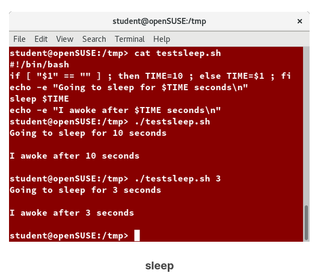

### Using at for Batch Processing in the Future

Schedule a very simple task to run at a future time from now. This can be as simple as running ls or date and saving the output. You can use a time as short as one minute in the future.

Note that the command will run in the directory from which you schedule it with at.

Do this:

            From a short bash script.
            Interactively.

1. Create the file testat.sh containing:

    `#!/bin/bash`
    `date > /tmp/datestamp`

    and then make it executable and queue it up with at:

    `$ chmod +x testat.sh`
    `$ at now + 1 minute -f testat.sh`

    You can see if the job is queued up to run with atq:

    `$ atq`
    17	Wed Apr 22 08:55:00 2015 a student

    Make sure the job actually ran:

    `$ cat /tmp/datestamp`
    Wed Apr 22 08:55:00 CDT 2015

    What happens if you take the /tmp/datestamp out of the command? (Hint: type mail if not prompted to do so!)

2. Interactively, it is basically the same procedure. Just queue up the job with:

    `$ at now + 1 minute`
    at> date > /tmp/datestamp
    CTRL-D
    `$ atq`

### Scheduling a Periodic Task with cron

Set up a cron job to do some simple task every day at 10 a.m.

Create a file named mycrontab with the following content:

0 10 * * * /tmp/myjob.sh
and then create /tmp/myjob.sh containing:

`#!/bin/bash`
`echo Hello I am running $0 at $(date)`

and make it executable:

`$ chmod +x /tmp/myjob.sh`

Put it in the crontab system with:

`$ crontab mycrontab`

and verify it was loaded with:

`$ crontab -l`

0 10 * * * /tmp/myjob.sh
`$ sudo ls -l /var/spool/cron/student`
-rw------- 1 student student 25 Apr 22 09:59 /var/spool/cron/student
`$ sudo cat /var/spool/cron/student`
0 10 * * * /tmp/myjob.sh

Note: If you don't really want this running every day, printing out messages like:

Hello I am running /tmp/myjob.sh at Wed Apr 22 10:03:48 CDT 2015

and mailing them to you, you can remove it with:

`$ crontab -r`

If the machine is not up at 10 AM on a given day, anacron will run the job at a suitable time.

### Chapter Summary

You have completed Chapter 9. Let’s summarize the key concepts covered:

- Processes are used to perform various tasks on the system.
. Processes can be single-threaded or multi-threaded.
- Processes can be of different types, such as interactive and non-interactive.
- Every process has a unique identifier (PID) to enable the operating system to keep track of it.
- The nice value, or niceness, can be used to set priority.
- ps provides information about the currently running processes.
- You can use top to get constant real-time updates about overall system performance, as well as information about the processes running on the system.
- Load average indicates the amount of utilization the system is under at particular times.
- Linux supports background and foreground processing for a job.
- at executes any non-interactive command at a specified time.
- cron is used to schedule tasks that need to be performed at regular intervals.

### Introduction to Filesystems

In Linux (and all UNIX-like operating systems) it is often said “Everything is a file”, or at least it is treated as such. This means whether you are dealing with normal data files and documents, or with devices such as sound cards and printers, you interact with them through the same kind of Input/Output (I/O) operations. This simplifies things: you open a “file” and perform normal operations like reading the file and writing on it (which is one reason why text editors, which you will learn about in an upcoming section, are so important).

On many systems (including Linux), the filesystem is structured like a tree. The tree is usually portrayed as inverted, and starts at what is most often called the root directory, which marks the beginning of the hierarchical filesystem and is also sometimes referred to as the trunk, or simply denoted by /. The root directory is not the same as the root user. The hierarchical filesystem also contains other elements in the path (directory names), which are separated by forward slashes (/), as in /usr/bin/emacs, where the last element is the actual file name.

In this section, you will learn about some basic concepts, including the filesystem hierarchy, as well as about disk partitions.

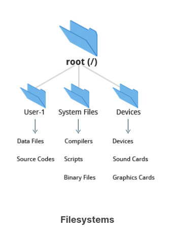

### Filesystem Varieties

Linux supports a number of native filesystem types, expressly created by Linux developers, such as:

            ext3
            ext4
            squashfs
            btrfs

It also offers implementations of filesystems used on other alien operating systems, such as those from:

            Windows (ntfs, vfat)
            SGI (xfs)
            IBM (jfs)
            MacOS (hfs, hfs+)

Many older, legacy filesystems, such as FAT, are also supported.

It is often the case that more than one filesystem type is used on a machine, based on considerations such as the size of files, how often they are modified, what kind of hardware they sit on and what kind of access speed is needed, etc. The most advanced filesystem types in common use are the journaling varieties: ext4, xfs, btrfs, and jfs. These have many state-of-the-art features and high performance, and are very hard to corrupt accidentally.

### Linux Partitions

Each filesystem on a Linux system occupies a disk partition. Partitions help to organize the contents of disks according to the kind and use of the data contained. For example, important programs required to run the system are often kept on a separate partition (known as root or /) than the one that contains files owned by regular users of that system (/home). In addition, temporary files created and destroyed during the normal operation of Linux may be located on dedicated partitions. One advantage of this kind of isolation by type and variability is that when all available space on a particular partition is exhausted, the system may still operate normally.

The picture shows the use of the gparted utility, which displays the partition layout on a system which has four operating systems on it: RHEL 8, CentOS 7, Ubuntu and Windows.

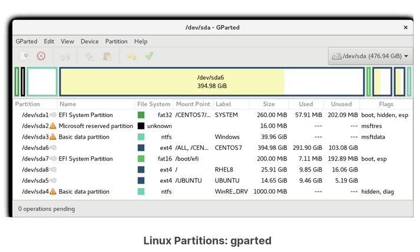

### Mount Points

Before you can start using a filesystem, you need to mount it on the filesystem tree at a mount point. This is simply a directory (which may or may not be empty) where the filesystem is to be grafted on. Sometimes, you may need to create the directory if it does not already exist.

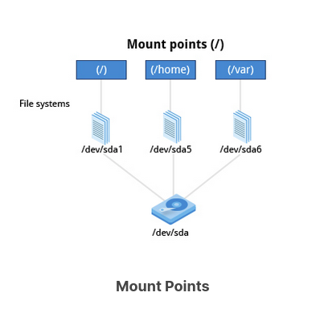

WARNING: If you mount a filesystem on a non-empty directory, the former contents of that directory are covered-up and not accessible until the filesystem is unmounted. Thus, mount points are usually empty directories.

### Mounting and Unmounting

The mount command is used to attach a filesystem (which can be local to the computer or on a network) somewhere within the filesystem tree. The basic arguments are the device node and mount point. For example,

`$ sudo mount /dev/sda5 /home`

will attach the filesystem contained in the disk partition associated with the /dev/sda5 device node into the filesystem tree at the /home mount point. There are other ways to specify the partition other than the device node, such as using the disk label or UUID.

To unmount the partition, the command would be:

`$ sudo umount /home`

Note the command is umount, not unmount! Only a root user (logged in as root, or using sudo) has the privilege to run these commands, unless the system has been otherwise configured.

If you want it to be automatically available every time the system starts up, you need to edit /etc/fstab accordingly (the name is short for filesystem table). Looking at this file will show you the configuration of all pre-configured filesystems. man fstab will display how this file is used and how to configure it.

Executing mount without any arguments will show all presently mounted filesystems.

### NFS and Network Filesystems

It is often necessary to share data across physical systems which may be either in the same location or anywhere that can be reached by the Internet. A network (also sometimes called distributed) filesystem may have all its data on one machine or have it spread out on more than one network node. A variety of different filesystems can be used locally on the individual machines; a network filesystem can be thought of as a grouping of lower level filesystems of varying types.

The command df -Th (disk-free) will display information about mounted filesystems, including the filesystem type, and usage statistics about currently used and available space.

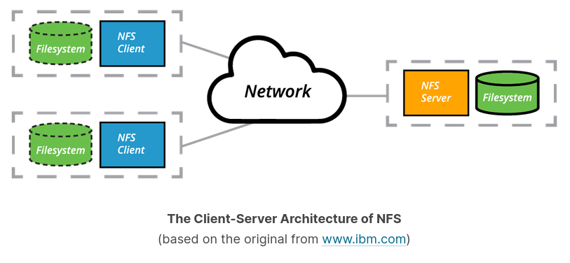

Many system administrators mount remote users' home directories on a server in order to give them access to the same files and configuration files across multiple client systems. This allows the users to log in to different computers, yet still have access to the same files and resources.

The most common such filesystem is named simply NFS (the Network Filesystem). It has a very long history and was first developed by Sun Microsystems. Another common implementation is CIFS (also termed SAMBA), which has Microsoft roots. We will restrict our attention in what follows to NFS.

### NFS on the Server

We will now look in detail at how to use NFS on the server.

On the server machine, NFS uses daemons (built-in networking and service processes in Linux) and other system servers are started at the command line by typing:

`$ sudo systemctl start nfs`

NOTE: On RHEL/CentOS 8, the service is called nfs-server, not nfs.

The text file /etc/exports contains the directories and permissions that a host is willing to share with other systems over NFS. A very simple entry in this file may look like the following:

/projects *.example.com(rw)

This entry allows the directory /projects to be mounted using NFS with read and write (rw) permissions and shared with other hosts in the example.com domain. As we will detail in the next chapter, every file in Linux has three possible permissions: read (r), write (w) and execute (x).

After modifying the /etc/exports file, you can type exportfs -av to notify Linux about the directories you are allowing to be remotely mounted using NFS. You can also restart NFS with sudo systemctl restart nfs, but this is heavier, as it halts NFS for a short while before starting it up again. To make sure the NFS service starts whenever the system is booted, issue sudo systemctl enable nfs.

### NFS on the Client

On the client machine, if it is desired to have the remote filesystem mounted automatically upon system boot, /etc/fstab is modified to accomplish this. For example, an entry in the client's /etc/fstab might look like the following:

servername:/projects /mnt/nfs/projects nfs defaults 0 0

You can also mount the remote filesystem without a reboot or as a one-time mount by directly using the mount command:

`$ sudo mount servername:/projects /mnt/nfs/projects`

Remember, if /etc/fstab is not modified, this remote mount will not be present the next time the system is restarted. Furthermore, you may want to use the nofail option in fstab in case the NFS server is not live at boot.

### Exploring Mounted Filesystems

Issue the command:

`student:/tmp> cat /etc/fstab`

Now type:

`student:/tmp> mount`

Compare the results. What are the differences?

Find another way to see a list of the mounted filesystems, by examining the /proc pseudo-filesystem.

Typically, mount will show more filesystems mounted than are shown in /etc/fstab, which only lists those which are explicitly requested.

The system, however, will mount additional special filesystems required for normal operation, which are not enumerated in /etc/fstab.

Another way to show mounted filesystems is to type:

`student:/tmp> cat /proc/mounts`

which is essentially how the utility gets its information.

### Overview of User Home Directories

In this section, you will learn to identify and differentiate between the most important directories found in Linux. We start with ordinary users' home directory space.

Each user has a home directory, usually placed under /home. The /root ("slash-root") directory on modern Linux systems is no more than the home directory of the root user (or superuser, or system administrator account).

On multi-user systems, the /home directory infrastructure is often mounted as a separate filesystem on its own partition, or even exported (shared) remotely on a network through NFS.

Sometimes, you may group users based on their department or function. You can then create subdirectories under the /home directory for each of these groups. For example, a school may organize /home with something like the following:

    /home/faculty/
    /home/staff/
    /home/students/

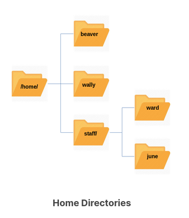

### The /bin and /sbin Directories

The /bin directory contains executable binaries, essential commands used to boot the system or in single-user mode, and essential commands required by all system users, such as cat, cp, ls, mv, ps, and rm.

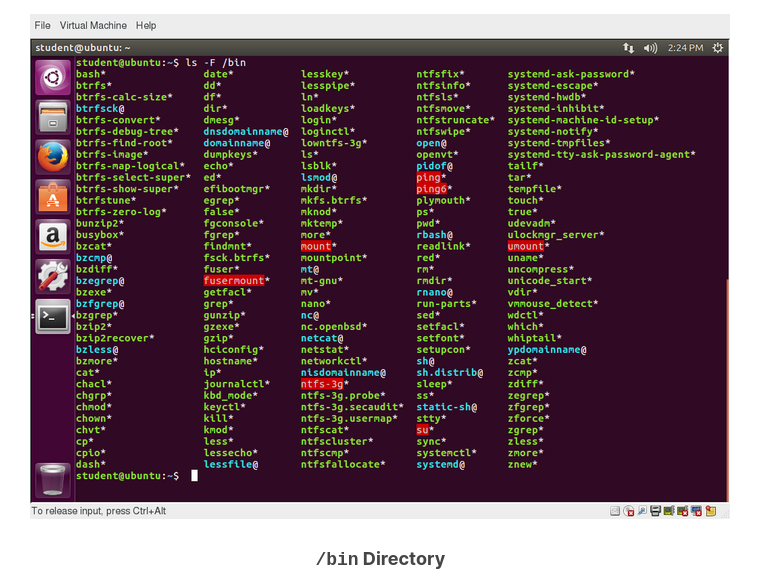

Likewise, the /sbin directory is intended for essential binaries related to system administration, such as fsck and ip. To view a list of these programs, type:

`$ ls /bin /sbin`

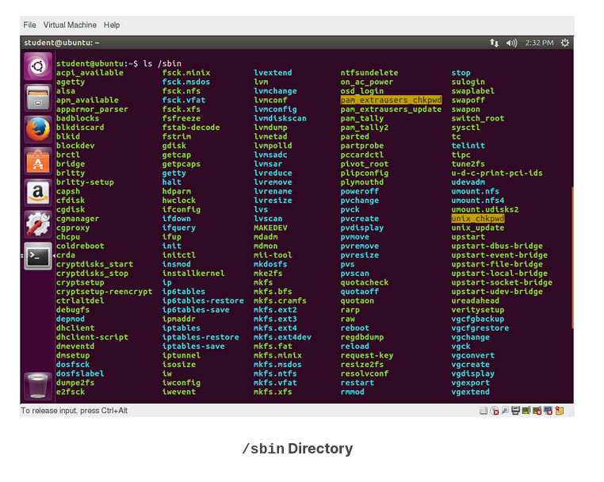

Commands that are not essential (theoretically) for the system to boot or operate in single-user mode are placed in the /usr/bin and /usr/sbin directories. Historically, this was done so /usr could be mounted as a separate filesystem that could be mounted at a later stage of system startup or even over a network. However, nowadays most find this distinction is obsolete. In fact, many distributions have been discovered to be unable to boot with this separation, as this modality had not been used or tested for a long time.

Thus, on some of the newest Linux distributions /usr/bin and /bin are actually just symbolically linked together, as are /usr/sbin and /sbin.

### The /proc Filesystem

Certain filesystems, like the one mounted at /proc, are called pseudo-filesystems because they have no permanent presence anywhere on the disk.

The /proc filesystem contains virtual files (files that exist only in memory) that permit viewing constantly changing kernel data. /proc contains files and directories that mimic kernel structures and configuration information. It does not contain real files, but runtime system information, e.g. system memory, devices mounted, hardware configuration, etc. Some important entries in /proc are:

    /proc/cpuinfo
    /proc/interrupts
    /proc/meminfo
    /proc/mounts
    /proc/partitions
    /proc/version

/proc has subdirectories as well, including:

    /proc/<Process-ID-#>
    /proc/sys

The first example shows there is a directory for every process running on the system, which contains vital information about it. The second example shows a virtual directory that contains a lot of information about the entire system, in particular its hardware and configuration. The /proc filesystem is very useful because the information it reports is gathered only as needed and never needs storage on the disk.

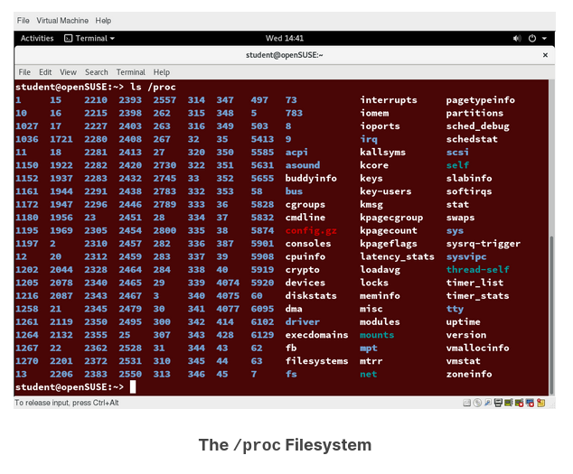

### The /dev Directory

The /dev directory contains device nodes, a type of pseudo-file used by most hardware and software devices, except for network devices. This directory is:

- Empty on the disk partition when it is not mounted

- Contains entries which are created by the udev system, which creates and manages device nodes on Linux, creating them dynamically when devices are found. The /dev directory contains items such as:

                    /dev/sda1 (first partition on the first hard disk)
                    /dev/lp1 (second printer)
                    /dev/random (a source of random numbers).

### The /var Directory

The /var directory contains files that are expected to change in size and content as the system is running (var stands for variable), such as the entries in the following directories:

            System log files: /var/log
            Packages and database files: /var/lib
            Print queues: /var/spool
            Temporary files: /var/tmp.

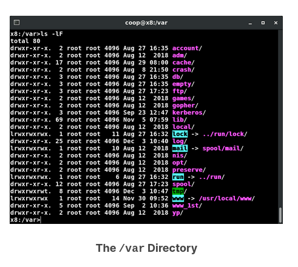

The /var directory may be put on its own filesystem so that growth of the files can be accommodated and any exploding file sizes do not fatally affect the system. Network services directories such as /var/ftp (the FTP service) and /var/www (the HTTP web service) are also found under /var.

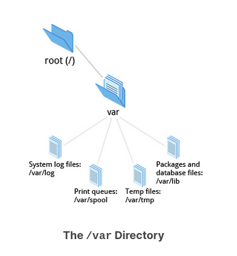

### The /etc Directory

The /etc directory is the home for system configuration files. It contains no binary programs, although there are some executable scripts. For example, /etc/resolv.conf tells the system where to go on the network to obtain host name to IP address mappings (DNS). Files like passwd, shadow and group for managing user accounts are found in the /etc directory. While some distributions have historically had their own extensive infrastructure under /etc (for example, Red Hat and SUSE have used /etc/sysconfig), with the advent of systemd there is much more uniformity among distributions today.

Note that /etc is for system-wide configuration files and only the superuser can modify files there. User-specific configuration files are always found under their home directory.

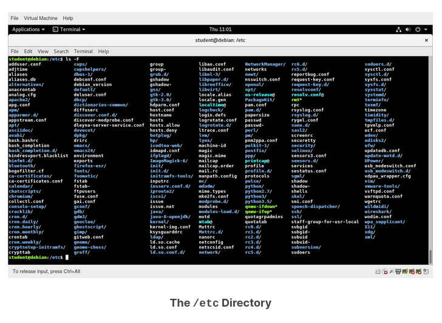

### The /boot Directory

The /boot directory contains the few essential files needed to boot the system. For every alternative kernel installed on the system there are four files:

1. vmlinuz
            The compressed Linux kernel, required for booting.
2. initramfs
            The initial ram filesystem, required for booting, sometimes called initrd, not initramfs.
3. config
            The kernel configuration file, only used for debugging and bookkeeping.
4. System.map
            Kernel symbol table, only used for debugging.

Each of these files has a kernel version appended to its name.

The Grand Unified Bootloader (GRUB) files such as /boot/grub/grub.conf or /boot/grub2/grub2.cfg are also found under the /boot directory.

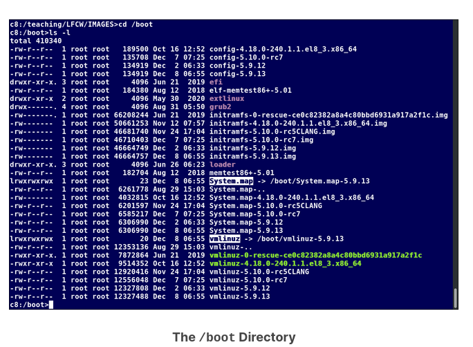

The screenshot shows an example listing of the /boot directory, taken from a RHEL system that has multiple installed kernels, including both distribution-supplied and custom-compiled ones. Names will vary and things will tend to look somewhat different on a different distribution.

### The /lib and /lib64 Directories

/lib contains libraries (common code shared by applications and needed for them to run) for the essential programs in /bin and /sbin. These library filenames either start with ld or lib. For example, /lib/libncurses.so.5.9.

Most of these are what is known as dynamically loaded libraries (also known as shared libraries or Shared Objects (SO)). On some Linux distributions there exists a /lib64 directory containing 64-bit libraries, while /lib contains 32-bit versions.

On recent Linux distributions, one finds:

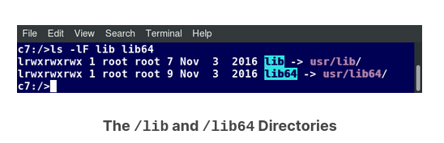

.e., just like for /bin and /sbin, the directories just point to those under /usr.

Kernel modules (kernel code, often device drivers, that can be loaded and unloaded without re-starting the system) are located in /lib/modules/\<kernel-version-number>.

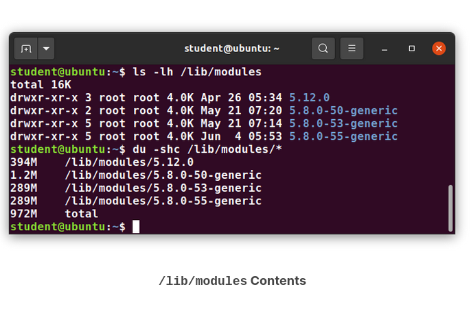

### Removable media: the /media, /run and /mnt Directories

One often uses removable media, such as USB drives, CDs and DVDs. To make the material accessible through the regular filesystem, it has to be mounted at a convenient location. Most Linux systems are configured so any removable media are automatically mounted when the system notices something has been plugged in.

While historically this was done under the /media directory, modern Linux distributions place these mount points under the /run directory. For example, a USB pen drive with a label myusbdrive for a user named student would be mounted at /run/media/student/myusbdrive.

The /mnt directory has been used since the early days of UNIX for temporarily mounting filesystems. These can be those on removable media, but more often might be network filesystems, which are not normally mounted. Or these can be temporary partitions, or so-called loopback filesystems, which are files which pretend to be partitions.

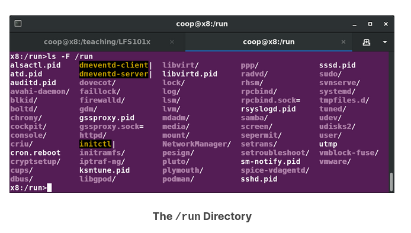

### Additional Directories Under /:

There are some additional directories to be found under the root directory:

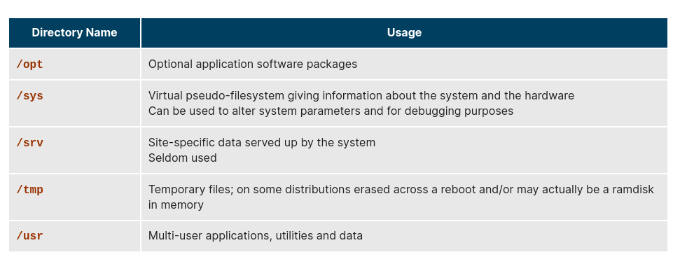

### The /usr Directory Tree

The /usr directory tree contains theoretically non-essential programs and scripts (in the sense that they should not be needed to initially boot the system) and has at least the following sub-directories:

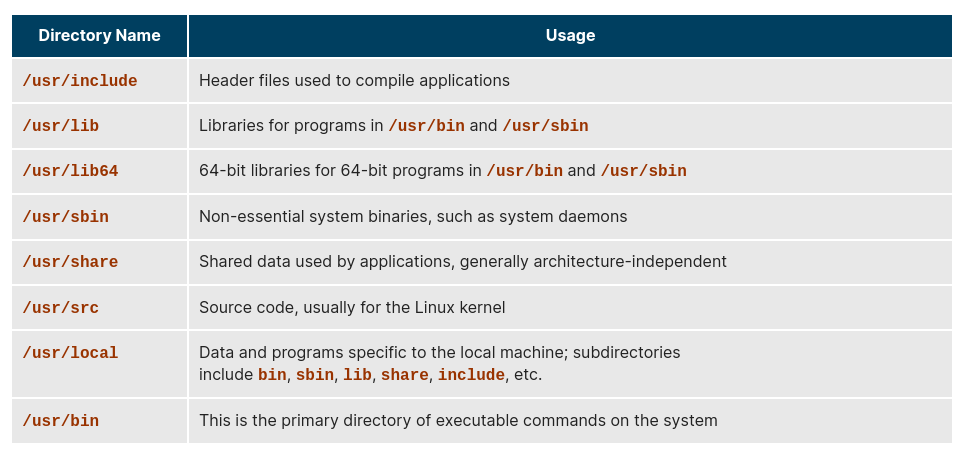

### Comparing Files with diff

Now that you know about the filesystem and its structure, let’s learn how to manage files and directories.

diff is used to compare files and directories. This often-used utility program has many useful options (see: man diff) including:

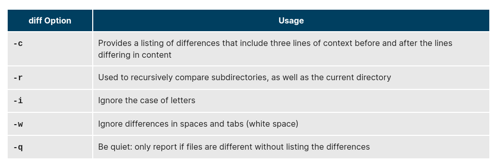

To compare two files, at the command prompt, type diff [options] \<filename1> \<filename2>. diff is meant to be used for text files; for binary files, one can use cmp. 

In this section, you will learn additional methods for comparing files and how to apply patches to files.

### Using diff3 and patch

You can compare three files at once using diff3, which uses one file as the reference basis for the other two. For example, suppose you and a co-worker both have made modifications to the same file working at the same time independently. diff3 can show the differences based on the common file you both started with. The syntax for diff3 is as follows:

`$ diff3 MY-FILE COMMON-FILE YOUR-FILE`

The graphic shows the use of diff3.

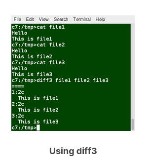

Many modifications to source code and configuration files are distributed utilizing patches, which are applied, not surprisingly, with the patch program. A patch file contains the deltas (changes) required to update an older version of a file to the new one. The patch files are actually produced by running diff with the correct options, as in:

`$ diff -Nur originalfile newfile > patchfile`

Distributing just the patch is more concise and efficient than distributing the entire file. For example, if only one line needs to change in a file that contains 1000 lines, the patch file will be just a few lines long.

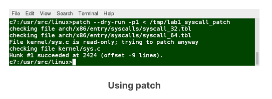

To apply a patch, you can just do either of the two methods below:

`$ patch -p1 < patchfile`
`$ patch originalfile patchfile`

The first usage is more common, as it is often used to apply changes to an entire directory tree, rather than just one file, as in the second example. To understand the use of the -p1 option and many others, see the man page for patch.

### Using the file Utility

In Linux, a file's extension often does not categorize it the way it might in other operating systems. One cannot assume that a file named file.txt is a text file and not an executable program. In Linux, a filename is generally more meaningful to the user of the system than the system itself. In fact, most applications directly examine a file's contents to see what kind of object it is rather than relying on an extension. This is very different from the way Windows handles filenames, where a filename ending with .exe, for example, represents an executable binary file.

The real nature of a file can be ascertained by using the file utility. For the file names given as arguments, it examines the contents and certain characteristics to determine whether the files are plain text, shared libraries, executable programs, scripts, or something else.

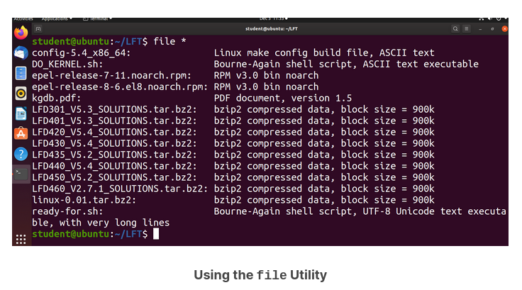

### Using diff and patch

Linux and other open source communities often use the patch utility to disseminate modifications and updates. Here, we will give a practical introduction to using diff and patch.

It would be a good idea to read the man pages for both patch and diff to learn more about advanced options and techniques, that will help one to work more effectively with patch. In particular, the form of patches has a lot to do with whether they can be accepted in their submitted form.

1. Change to the /tmp directory.
2. Copy a text file to /tmp. For example, copy /etc/group to /tmp.
3. dd cannot only copy directly from raw disk devices, but from regular files as well. Remember, in Linux, everything is pretty much treated as a file. dd can also perform various conversions. For example, the conv=ucase option will convert all of the characters to upper-case characters. We will use dd to copy the text file to a new file in /tmp while converting characters to upper-case, as in: student:/tmp> dd if=/tmp/group of=/tmp/GROUP conv=ucase.
4. According to the man page for patch, the preferred options for preparing a patch with diff are -Naur when comparing two directory trees recursively. We will ignore the -a option, which means treat all files as text, since patch and diff should only be used on text files anyway. Since we are just comparing two files, we do not need to use the N or r options to diff, but we could use them anyway as it will not make a difference. Compare group and GROUP using diff, and prepare a proper patch file.
5. Use patch to patch the original file, /tmp/group, so its contents now match those of the modified file, /tmp/GROUP. You might try with the --dry-run option first!
6. Finally, to prove that your original file is now patched to be the same one with all upper-case characters, use diff on those two files. The files should be the same and you will not get any output from diff.

or this exercise, you could use any text file, but we will use /etc/group as described.

    student:/tmp> cd /tmp
    student:/tmp> cp /etc/group /tmp
    student:/tmp> dd if=/tmp/group of=/tmp/GROUP conv=ucase
    1+1 records in
    1+1 records out
    963 bytes (963 B) copied, 0.000456456 s, 2.1 MB/s
    student:/tmp> diff -Nur group GROUP > patchfile
    student:/tmp> cat patchfile

    --- group       2015-04-17 11:03:26.710813740 -0500
    +++ GROUP       2015-04-17 11:15:14.602813740 -0500
    @@ -1,68 +1,68 @@
    -root:x:0:
    -daemon:x:1:
    -bin:x:2:
    -sys:x:3:
    ....
    -libvirtd:x:127:student
    -vboxsf:x:999:
    +ROOT:X:0:
    +DAEMON:X:1:
    +BIN:X:2:
    +SYS:X:3:
    .....
    student:/tmp> patch --dry-run group patchfile
    checking file group
    student:/tmp> patch  group patchfile
    patching file group
    Note you could have also done either of these two commands:
    student:/tmp> patch group < patchfile
    student:/tmp> patch < patchfile
    student:/tmp> diff group GROUP
    student:/tmp>

### Backing Up Data

There are many ways you can back up data or even your entire system. Basic ways to do so include the use of simple copying with cp and use of the more robust rsync.

Both can be used to synchronize entire directory trees. However, rsync is more efficient, because it checks if the file being copied already exists. If the file exists and there is no change in size or modification time, rsync will avoid an unnecessary copy and save time. Furthermore, because rsync copies only the parts of files that have actually changed, it can be very fast.

cp can only copy files to and from destinations on the local machine (unless you are copying to or from a filesystem mounted using NFS), but rsync can also be used to copy files from one machine to another. Locations are designated in the target:path form, where target can be in the form of someone@host. The someone@ part is optional and used if the remote user is different from the local user.

rsync is very efficient when recursively copying one directory tree to another, because only the differences are transmitted over the network. One often synchronizes the destination directory tree with the origin, using the -r option to recursively walk down the directory tree copying all files and directories below the one listed as the source.

### Using rsync

sync is a very powerful utility. For example, a very useful way to back up a project directory might be to use the following command:

`$ rsync -r project-X archive-machine:archives/project-X`

Note that rsync can be very destructive! Accidental misuse can do a lot of harm to data and programs, by inadvertently copying changes to where they are not wanted. Take care to specify the correct options and paths. It is highly recommended that you first test your rsync command using the -dry-run option to ensure that it provides the results that you want.

To use rsync at the command prompt, type rsync sourcefile destinationfile, where either file can be on the local machine or on a networked machine; The contents of sourcefile will be copied to destinationfile.

A good combination of options is shown in:

`$ rsync --progress -avrxH  --delete sourcedir destdir`

### Compressing Data

File data is often compressed to save disk space and reduce the time it takes to transmit files over networks.

Linux uses a number of methods to perform this compression, including:

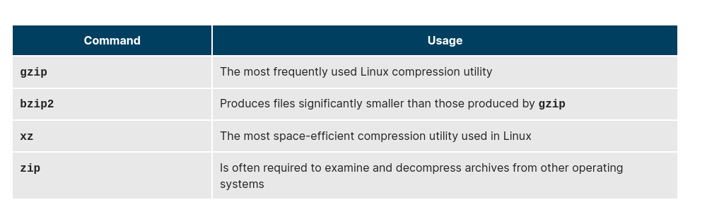

These techniques vary in the efficiency of the compression (how much space is saved) and in how long they take to compress; generally, the more efficient techniques take longer. Decompression time does not vary as much across different methods.

In addition, the tar utility is often used to group files in an archive and then compress the whole archive at once.

### Compressing Data Using gzip

gzip is the most often used Linux compression utility. It compresses very well and is very fast. The following table provides some usage examples:

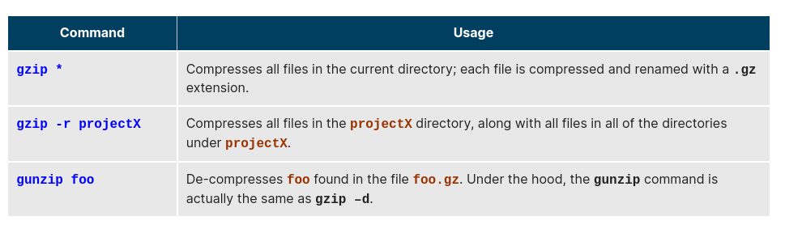

### Compressing Data Using bzip2

bzip2 has a syntax that is similar to gzip but it uses a different compression algorithm and produces significantly smaller files, at the price of taking a longer time to do its work. Thus, it is more likely to be used to compress larger files.

Examples of common usage are also similar to gzip:

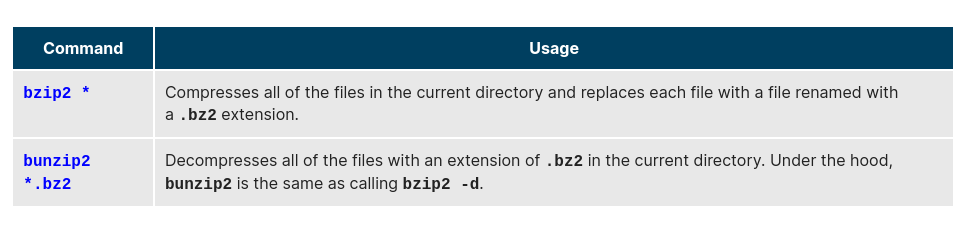

NOTE: bzip2 has lately become deprecated due to lack of maintenance and the superior compression ratios of xz which is actively maintained.

### Compressing Data Using xz

xz is the most space efficient compression utility used in Linux and is used to store archives of the Linux kernel. Once again, it trades a slower compression speed for an even higher compression ratio.

Some usage examples:

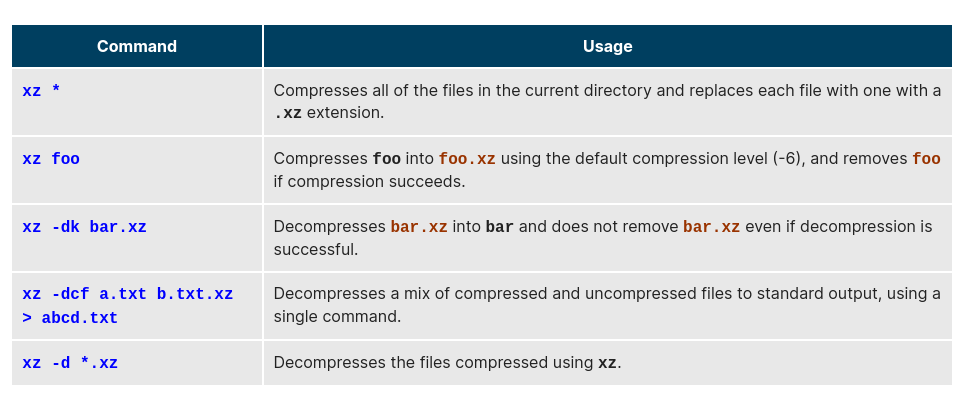

Compressed files are stored with a .xz extension.

### Handling Files Using zip

 The zip program is not often used to compress files in Linux, but is often required to examine and decompress archives from other operating systems. It is only used in Linux when you get a zipped file from a Windows user. It is a legacy program.

 

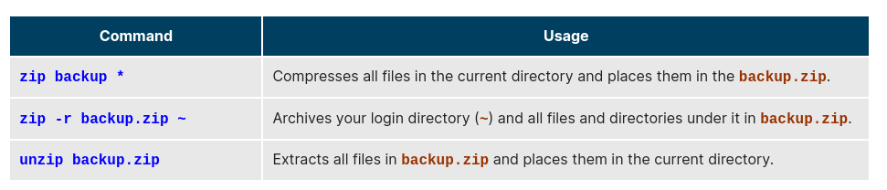

### Archiving and Compressing Data Using tar

Historically, tar stood for "tape archive" and was used to archive files to a magnetic tape. It allows you to create or extract files from an archive file, often called a tarball. At the same time, you can optionally compress while creating the archive, and decompress while extracting its contents.

Here are some examples of the use of tar:

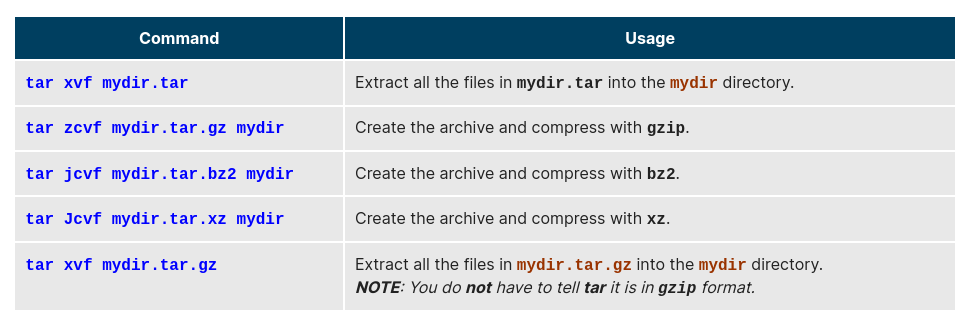

You can separate out the archiving and compression stages, as in:

`$ tar cvf mydir.tar mydir ; gzip mydir.tar`
`$ gunzip mydir.tar.gz ; tar xvf mydir.tar`

but this is slower and wastes space by creating an unneeded intermediary .tar file.

### Relative Compression Times and Sizes

To demonstrate the relative efficiency of gzip, bzip2, and xz, the following screenshot shows the results of compressing a purely text file directory tree (the include directory from the kernel source) using the three methods.

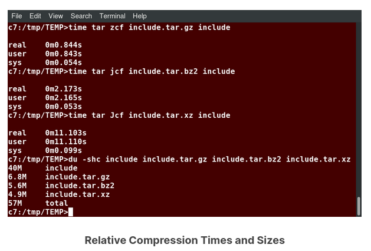

This shows that as compression factors go up, CPU time does as well (i.e. producing smaller archives takes longer).

### Disk-to-Disk Copying (dd)

The dd program is very useful for making copies of raw disk space. For example, to back up your Master Boot Record (MBR) (the first 512-byte sector on the disk that contains a table describing the partitions on that disk), you might type:

`dd if=/dev/sda of=sda.mbr bs=512 count=1`

WARNING!

Typing:

`dd if=/dev/sda of=/dev/sdb`

to make a copy of one disk onto another, will delete everything that previously existed on the second disk.

An exact copy of the first disk device is created on the second disk device.

##### Do not experiment with this command as written above, as it can erase a hard disk!

Exactly what the name dd stands for is an often-argued item. The words data definition is the most popular theory and has roots in early IBM history. Often, people joke that it means disk destroyer and other variants such as delete data!

### Archiving (Backing Up) the Home Directory

Archiving (or backing up) your files from time to time is essential good hygiene. You might type a command and thereby unintentionally clobber files you need and did not mean to alter.

Furthermore, while your hardware may be deemed fairly reliable, all devices do fail in some fashion eventually (even if it is just an unexpected power failure). Often, this happens at the worst possible time. Periodically backing up files is a good habit to get into.

It is, of course, important to do backups to external systems through a network, or onto external storage, such as an external drive or USB stick. Here, we will be making a backup archive on the same system, which is very useful, but won’t help if the drive fails catastrophically, or your computer is stolen or the building gets zapped by an asteroid or a fire.

First, using tar, backup all files and subdirectories under your home directory. Place the resulting tarball file in the /tmp directory, giving it the name backup.tar.

Second, accomplish the same task with gzip compression using the -z option to tar, creating /tmp/backup.tar.gz.

Compare the size of the two files (with ls -l).

For additional experience, make backups using the -j option using the bzip2 compression, and -J option for using the xz compression.

To construct a tarball archive of your home directory, you can do:

student:/tmp> tar -cvf /tmp/backup.tar ~

or equivalently

student:/tmp> tar -cvf /tmp/backup.tar /home/student

Note you can have omitted the - in the options with no change. In the following, we will not bother using the -v option for verbose. To create archives with all three compression utilities, run:

student:/tmp> tar zcf /tmp/backup.tar.gz ~
student:/tmp> tar jcf /tmp/backup.tar.bz2 ~
student:/tmp> tar Jcf /tmp/backup.tar.xz ~

Comparing the sizes (first using the -h option to ls to make it human-readable):

student@ubuntu:~student:/tmp> ls -lh /tmp/backup*

-rw-rw-r-- 1 student student 8.3M Apr 17 10:14 /tmp/backup2.tar.gz
-rw-rw-r-- 1 student student  12M Apr 17 10:13 /tmp/backup.tar
-rw-rw-r-- 1 student student 8.4M Apr 17 10:15 /tmp/backup.tar.bz2
-rw-rw-r-- 1 student student 8.3M Apr 17 10:14 /tmp/backup.tar.gz
-rw-rw-r-- 1 student student 8.2M Apr 17 10:15 /tmp/backup.tar.xz     

and then without it:

student@ubuntu:~student:/tmp> ls -l /tmp/backup*

-rw-rw-r-- 1 student student  8686942 Apr 17 10:14 /tmp/backup2.tar.gz
-rw-rw-r-- 1 student student 12226560 Apr 17 10:13 /tmp/backup.tar
-rw-rw-r-- 1 student student  8720491 Apr 17 10:15 /tmp/backup.tar.bz2
-rw-rw-r-- 1 student student  8686929 Apr 17 10:14 /tmp/backup.tar.gz
-rw-rw-r-- 1 student student  8551064 Apr 17 10:15 /tmp/backup.tar.xz

Note in this case, there is not much difference in the different archiving methods, but this particular directory was a bad choice because it already contained a lot of compressed files. A somewhat better example involving more text files:

student:/tmp> tar cf  /tmp/doc.tar     /usr/share/doc
student:/tmp> tar zcf /tmp/doc.tar.gz  /usr/share/doc
student:/tmp> tar jcf /tmp/doc.tar.bz2 /usr/share/doc
student:/tmp> tar Jcf /tmp/doc.tar.xz  /usr/share/doc
student:/tmp> ls -lh /tmp/doc.tar*

-rw-rw-r-- 1 student student 85M Apr 17 10:34 /tmp/doc.tar
-rw-rw-r-- 1 student student 31M Apr 17 10:35 /tmp/doc.tar.bz2
-rw-rw-r-- 1 student student 34M Apr 17 10:34 /tmp/doc.tar.gz
-rw-rw-r-- 1 student student 28M Apr 17 10:36 /tmp/doc.tar.xz

which shows xz did best, followed by bz2 and then gz. You may have noticed, however, the inverse relationship between the size reduction of the compression and how long it took!

### Chapter Summary

You have completed Chapter 10. Let’s summarize the key concepts covered:

- The filesystem tree starts at what is often called the root directory (or trunk, or /).
- The  Filesystem Hierarchy Standard (FHS) provides Linux developers and system administrators a standard directory structure for the filesystem.
- Partitions help to segregate files according to usage, ownership, and type.
- Filesystems can be mounted anywhere on the main filesystem tree at a mount point. Automatic filesystem mounting can be set up by editing /etc/fstab.
- NFS (Network File System) is a useful method for sharing files and data through the network systems.
- Filesystems like /proc are called pseudo filesystems because they exist only in memory.
- /root (slash-root) is the home directory for the root user.
- /var may be put in its own filesystem so that growth can be contained and not fatally affect the system.
- /boot contains the basic files needed to boot the system.
- patch is a very useful tool in Linux. Many modifications to source code and configuration files are distributed with patch files, as they contain the deltas or changes to go from an old version of a file to the new version of a file.
- File extensions in Linux do not necessarily mean that a file is of a certain type.
- cp is used to copy files on the local machine, while rsync can also be used to copy files from one machine to another, as well as synchronize contents.
- gzip, bzip2, xz and zip are used to compress files.
- tar allows you to create or extract files from an archive file, often called a tarball. You can optionally compress while creating the archive, and decompress while extracting its contents.
- dd can be used to make large exact copies, even of entire disk partitions, efficiently.

### Overview of Text Editors in Linux

At some point, you will need to manually edit text files. You might be composing an email off-line, writing a script to be used for bash or other command interpreters, altering a system or application configuration file, or developing source code for a programming language such as C, Python or Java.

Linux administrators may sidestep using a text editor, instead employing graphical utilities for creating and modifying system configuration files. However, this can be more laborious than directly using a text editor, and be more limited in capability. Note that word processing applications (including those that are part of common office application suites) are not really basic text editors; they add a lot of extra (usually invisible) formatting information that will probably render system administration configuration files unusable for their intended purpose. So, knowing how to confidently use one or more text editors is really an essential skill to have for Linux.

By now, you have certainly realized Linux is packed with choices; when it comes to text editors, there are many choices, ranging from quite simple to very complex, including:

            nano
            gedit
            vi
            emacs

In this section, we learn first about the nano and gedit editors, which are relatively simple and easy to learn, and then later the more complicated choices, vi and emacs. Before we start, let us take a look at some cases where an editor is not needed.

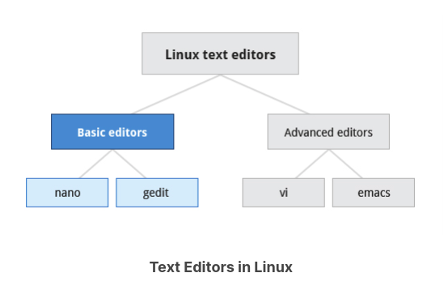

### Creating Files Without Using an Editor

Sometimes, you may want to create a short file and don't want to bother invoking a full text editor. In addition, doing so can be quite useful when used from within scripts, even when creating longer files. You will no doubt find yourself using this method when you start on the later chapters that cover shell scripting!

If you want to create a file without using an editor, there are two standard ways to create one from the command line and fill it with content.

The first is to use echo repeatedly:

        $ echo line one > myfile
        $ echo line two >> myfile
        $ echo line three >> myfile

Note that while a single greater-than sign (>) will send the output of a command to a file, two of them (>>) will append the new output to an existing file.

The second way is to use cat combined with redirection:

        $ cat << EOF > myfile
        > line one
        > line two
        > line three
        > EOF
        $

Both techniques produce a file with the following lines in it:

        line one
        line two
        line three

and are extremely useful when employed by scripts.

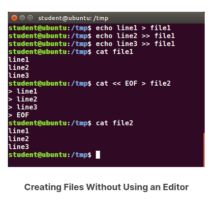

### nano and gedit

There are some text editors that are pretty obvious; they require no particular experience to learn and are actually quite capable, even robust. A particularly easy to use one is the text terminal-based editor nano. Just invoke nano by giving a file name as an argument. All the help you need is displayed at the bottom of the screen, and you should be able to proceed without any problem.

As a graphical editor, gedit is part of the GNOME desktop system (kwrite is associated with KDE). The gedit and kwrite editors are very easy to use and are extremely capable. They are also very configurable. They look a lot like Notepad in Windows. Other variants such as kate are also supported by KDE.

### nano

nano is easy to use, and requires very little effort to learn. To open a file, type nano <filename> and press Enter. If the file does not exist, it will be created.

nano provides a two line shortcut bar at the bottom of the screen that lists the available commands. Some of these commands are:

            CTRL-G
            Display the help screen.
            CTRL-O
            Write to a file.
            CTRL-X
            Exit a file.
            CTRL-R
            Insert contents from another file to the current buffer.
            CTRL-C
            Show cursor position.

### gedit

gedit (pronounced 'g-edit') is a simple-to-use graphical editor that can only be run within a Graphical Desktop environment. It is visually quite similar to the Notepad text editor in Windows, but is actually far more capable and very configurable and has a wealth of plugins available to extend its capabilities further.

To open a new file find the program in your desktop's menu system, or from the command line type gedit <filename>. If the file does not exist, it will be created.

Using gedit is pretty straightforward and does not require much training. Its interface is composed of quite familiar elements.

### vi and emacs

Developers and administrators experienced in working on UNIX-like systems almost always use one of the two venerable editing options: vi and emacs. Both are present or easily available on all distributions and are completely compatible with the versions available on other operating systems. 

Both vi and emacs have a basic purely text-based form that can run in a non-graphical environment. They also have one or more graphical interface forms with extended capabilities; these may be friendlier for a less experienced user. While vi and emacs can have significantly steep learning curves for new users, they are extremely efficient when one has learned how to use them.

You need to be aware that fights among seasoned users over which editor is better can be quite intense and are often described as a holy war.

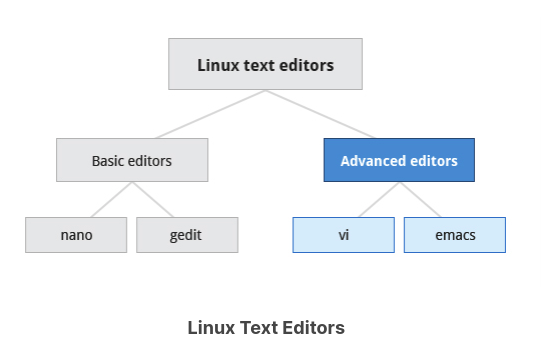

### Introduction to vi

Usually, the actual program installed on your system is vim, which stands for Vi IMproved, and is aliased to the name vi. The name is pronounced as “vee-eye”.

Even if you do not want to use vi, it is good to gain some familiarity with it: it is a standard tool installed on virtually all Linux distributions. Indeed, there may be times where there is no other editor available on the system.

GNOME extends vi with a very graphical interface known as gvim and KDE offers kvim. Either of these may be easier to use at first. 

When using vi, all commands are entered through the keyboard. You do not need to keep moving your hands to use a pointer device such as a mouse or touchpad, unless you want to do so when using one of the graphical versions of the editor.

### vimtutor

Typing vimtutor launches a short but very comprehensive tutorial for those who want to learn their first vi commands. Even though it provides only an introduction and just seven lessons, it has enough material to make you a very proficient vi user, because it covers a large number of commands. After learning these basic ones, you can look up new tricks to incorporate into your list of vi commands because there are always more optimal ways to do things in vi with less typing.

### Modes in vi

vi provides three modes, as described in the table below. It is vital to not lose track of which mode you are in. Many keystrokes and commands behave quite differently in different modes.

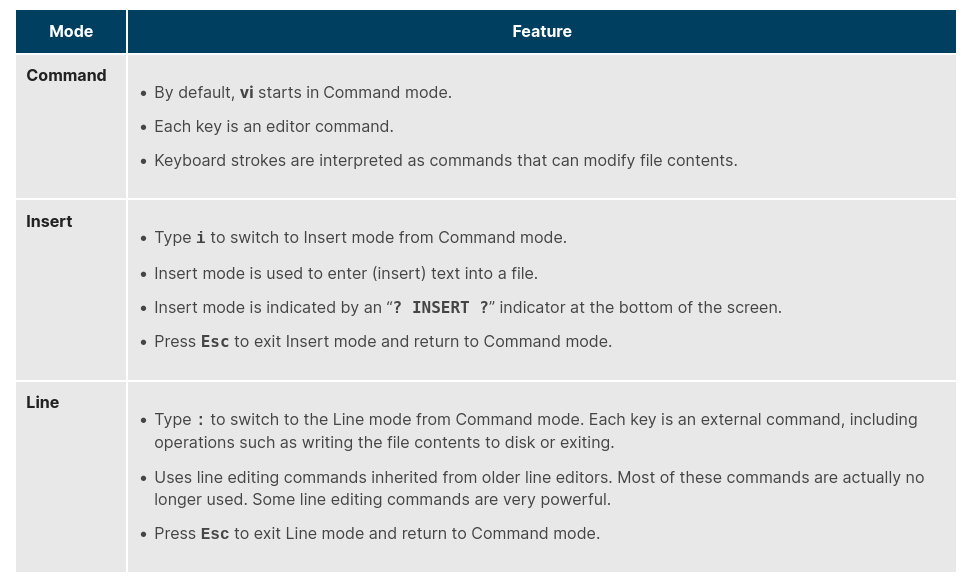

### Working with Files in vi

The table describes the most important commands used to start, exit, read, and write files in vi. The ENTER key needs to be pressed after all of these commands.

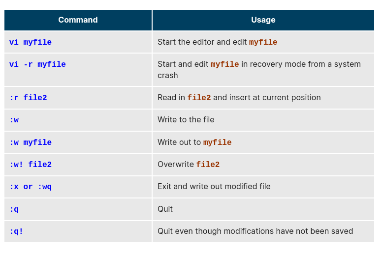

### Changing Cursor Positions in vi

The table describes the most important keystrokes used when changing cursor position in vi. Line mode commands (those following colon : ) require the ENTER key to be pressed after the command is typed.

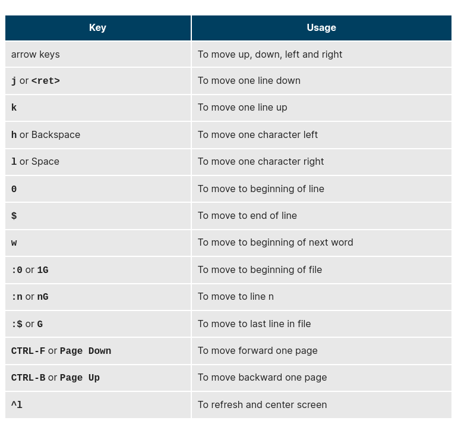

### Searching for Text in vi

The table describes the most important commands used when searching for text in vi. The ENTER key should be pressed after typing the search pattern.

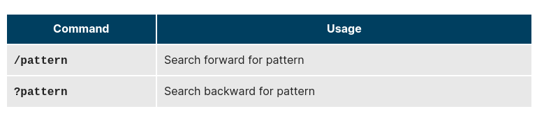

The table describes the most important keystrokes used when searching for text in vi.

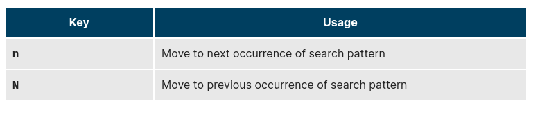

